# How to Add Currency Switcher in WordPress Form?

In [Paymattic](https://paymattic.com/), the Currency Switcher feature enables donors to select from over 135 currencies directly within the donation form. This article will guide you on embedding the Currency Switcher field into the WordPress Site through Paymattic.

<iframe width="560" height="315" src="https://www.youtube.com/embed/Dcyyd7W9aW4?list=PLXpD0vT4thWH80g5e9wYnoBMgEqUXbr53" title="Currency Switcher Tutorial" frameborder="0" allow="accelerometer; autoplay; clipboard-write; encrypted-media; gyroscope; picture-in-picture" allowfullscreen></iframe>

::: warning
**Currency Switcher** is a premium feature that only works for the [Donation Form](./simple-form-templates.md) (specifically, for the [Donation Progress Item](./how-to-add-donation-progress-item-in-wordpress-with-paymattic.md) field). So, you need the [Paymattic Pro Plugin](./how-to-install-and-activate-paymattic-in-wordpress.md) **to use this field.**
:::

## Adding Currency Switcher Field

To learn how to add the **Currency Switcher** to the Paymattic Form on your WordPress site, follow the steps with the screenshots below –  

First, go to the **All Forms** section from the **Pymattic Navbar,** choose a **Donation Form,** and click the **Pencil/Edit** icon to open the **Editor** page of that form.

::: tip
If you do not have any existing donation forms, read this [Create a Form from Scratch](./how-to-create-a-form-from-scratch-with-paymattic.md) or [Create a Form using Templates](./simple-form-templates.md) documentation to create one.
:::

For example, I choose an existing Donation Form to show the whole process.

Once you open the **Editor** page, add the **Currency Switcher** field by typing the **"/"** or clicking the **Plus Icon** at the bottom.

::: tip
We always suggest you keep the [**Name**](./how-to-use-general-form-input-fields-in-wordpress-with-paymattic.md#5-toc-title) and [**Email**](./how-to-use-general-form-input-fields-in-wordpress-with-paymattic.md#6-toc-title) field at the beginning of any Form.
:::

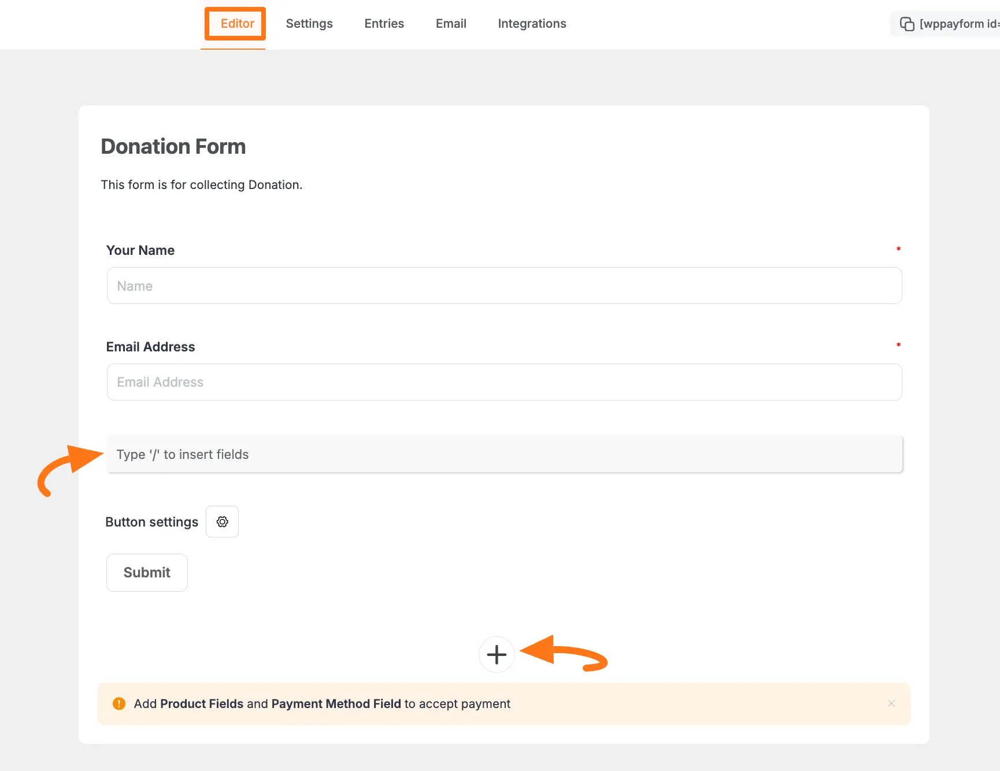

For example, I choose the **Plus Icon** option to select the **Tax Calculated Amount** field under the **Donation & Product Fields** section from the **Choose Form Field** page.

::: tip
Also, don't forget to add a [**Donation Progress Item**](./how-to-add-donation-progress-item-in-wordpress-with-paymattic.md) field to make the **Currency Switcher** field functional and a [**Payment Method Field**](./how-to-use-the-payment-method-fields-section.md) to collect donations.
:::

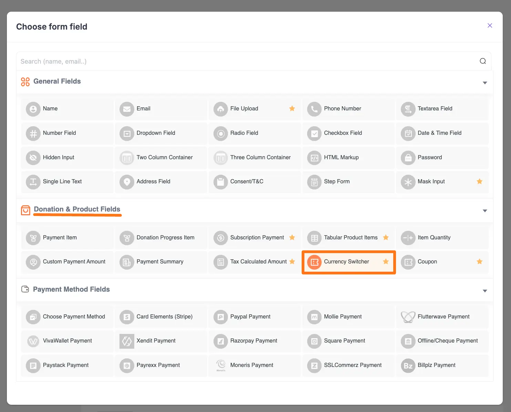

## Editing/Customizing the Field

You can see the **Currency Switcher** and other necessary fields added to the form.

::: tip
You can edit their field name and settings. To learn more about form editing, read this [Documentation](./how-to-edit-forms-in-wordpress-with-paymattic.md).
:::

Specifically, to edit the **Currency Switcher** field according to your needs, click the **Settings Icon** from the right-side corner.

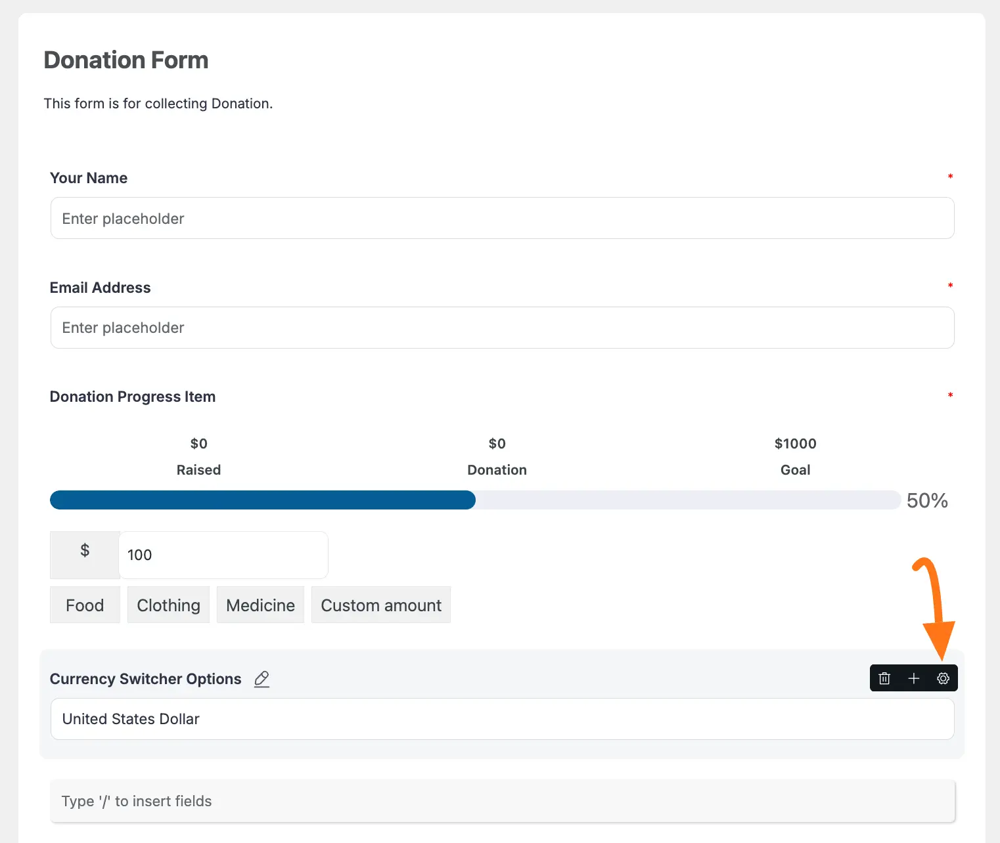

Now, a pop-up page will appear with various settings options for customizing the field. 

### General Settings 

All the Settings under the General Tab mentioned in the below screenshot are briefly explained:

- **Required**: Enable this option to make this field mandatory for users to fill in for a successful submission. 

- **Switch Options**: Here, you can choose the currency/currencies from the dropdown list as a switch option/according to your needs. To add as many currencies as you need, click the **+ Add More** button, and to delete any chosen currency if required, click the **Trash Icon**.

- **Display Type**: With this option, you can set whether you want to set the currency selection type as a **Radio** button or **Select** (dropdown list). 

::: warning
But, to make the Currency Switcher functional, you must **Configure the API Key** in the General Settings of Paymattic and add the [Donation Progress Item](./how-to-add-donation-progress-item-in-wordpress-with-paymattic.md) field in your form.
:::

Once you finish, click the **Update** button to save all your configuration. 

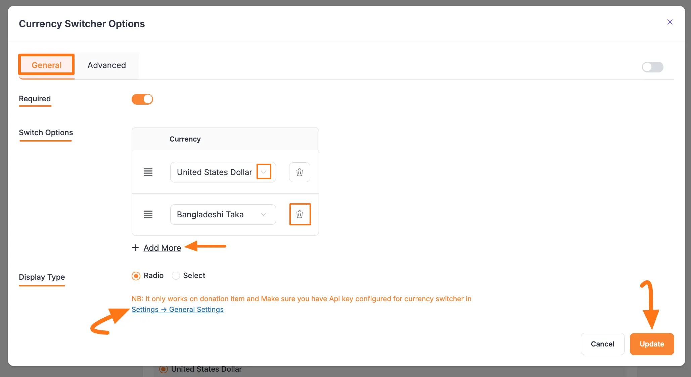

#### API Key Configuration in Paymattic's General Settings

To make the currency switcher field functional, you must configure your Currency API Key in the General Settings of Paymattic. To learn the process, follow the steps below – 

##### Get the API Key from Currency API

First, log in to your [Currency API](http://currencyapi.com) dashboard, go to the **API Keys** tab, and create a new API key. 

To get the option of creating a new API key, delete the existing one by clicking the **Trash** Icon.

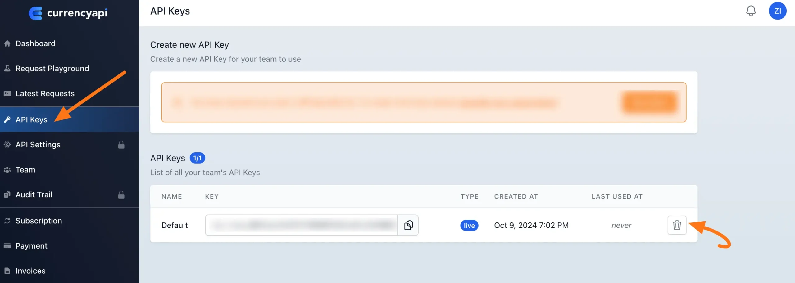

Now, name your API key, select **Live API Key** for real use or **Sandbox API Key** for testing, and click **Create API Key**.

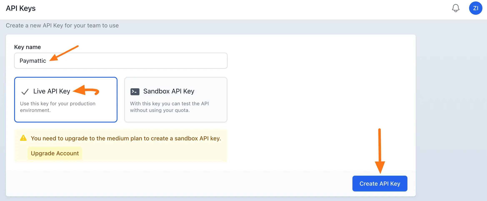

Here, you can see your newly created API key. Now, copy it.

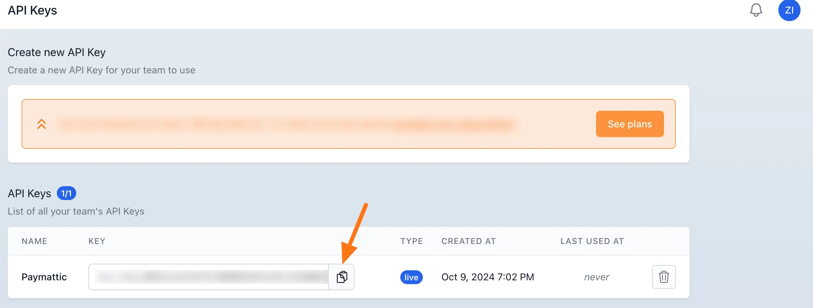

##### Configure API Key in Currency Switcher Settings

Now, go to **Settings** from the **Paymattic Navbar**, click the **General Settings** tab from the left sidebar, and you will get the **Currency Switcher** Settings section.

Here, you will get two settings options. These are:

- **Currency Conversion API Key**: Here, you need to paste the API Key you got from your [Currency API Dashboard](http://currencyapi.com). Once configured, the currency switcher feature will start working for your donation forms.

- **Caching Interval**: Set a Caching Interval for updating the currency rates for your donation form. A higher Caching interval will reduce the amount of API requests. 300 Requests are free per month. However, you can extend your API request limits [here](https://app.currencyapi.com/subscription).

  We recommend you set the Caching Interval – 24 hours. For example, if you set 24 hours Caching Interval then the API will update the currency rate once every 24 hours.

Once you finish, click the **Save Settings** button to save your configuration. 

::: tip
To learn more details about **Currency Settings**, read this [Documentation](./how-to-change-currency-settings-in-wordpress-with-paymattic.md).
:::

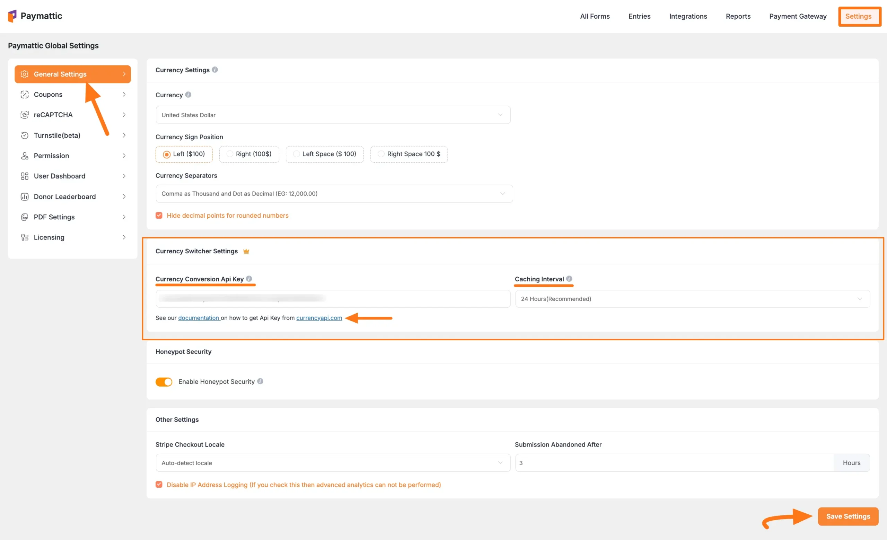

### Advanced Settings 

Once you complete the General settings, go to the **Advanced** tab, and you will find some advanced settings for your Currency Switcher field. These are:

- **Admin Label**: This label is used for the admin wants to see the field's label from the back end.

- **Field Wrapper CSS Class**: This is used for adding a Custom CSS/JS for an entire field of a specific form using the Field Wrapper CSS Class element. To learn more, click [here](./how-to-create-custom-css-js-in-wordpress-with-paymattic.md).

- **Input Elements CSS Class**: This is used for adding a Custom CSS/JS for a specific input field of a form using the Input Elements CSS Class element. To learn more, click [here](./how-to-create-custom-css-js-in-wordpress-with-paymattic.md).

- **Conditional Render**: You can set conditional logic to display the field in the form that will be triggered by specific actions taken on a previous input field. To learn more about conditional renderings, click [here](./how-to-use-conditional-logic-in-form-fields-with-paymattic.md).

- **Field ID**: This option is used for adding or tracking form fields. Plus, creating the custom CSS/JS for a specific form field.

Once you finish, click the **Update** button to save all your configuration. 

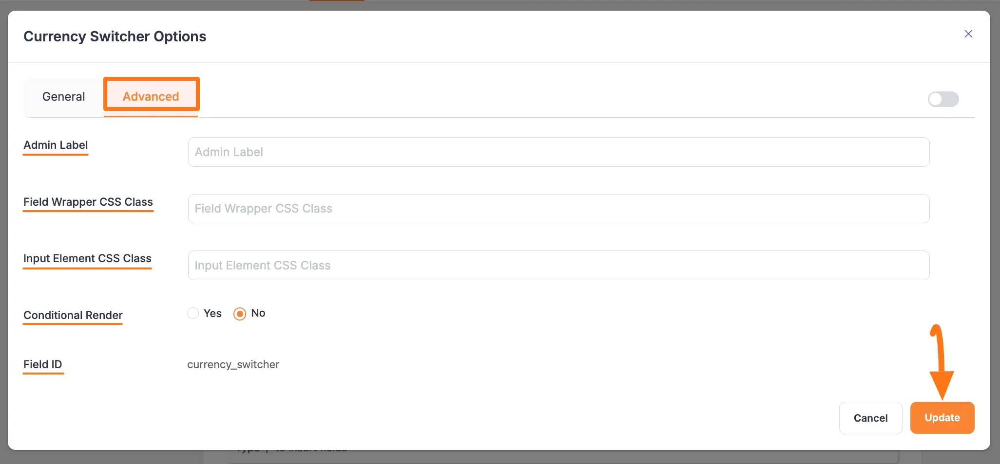

## Embedding Form into Frontend

Here, you can see the **Currency Switcher** field and other necessary fields are added to the form.

Now, to embed and display the form on a specific Page/Post, **copy** this **Shortcode** and paste it into your desired Page/Post.

Once you complete the edit, press the **Save** button to save all the changes you made. And, to see the **Preview** of the form, click the **Eye** icon.

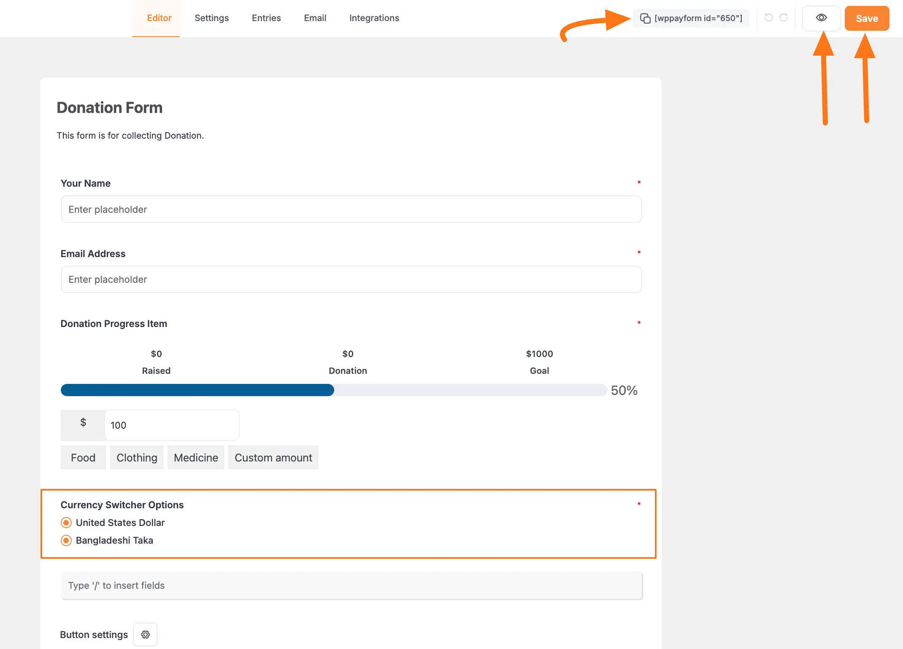

## Preview of the Currency Switcher field

Here is the preview of the **Currency Switcher** field in a Form.

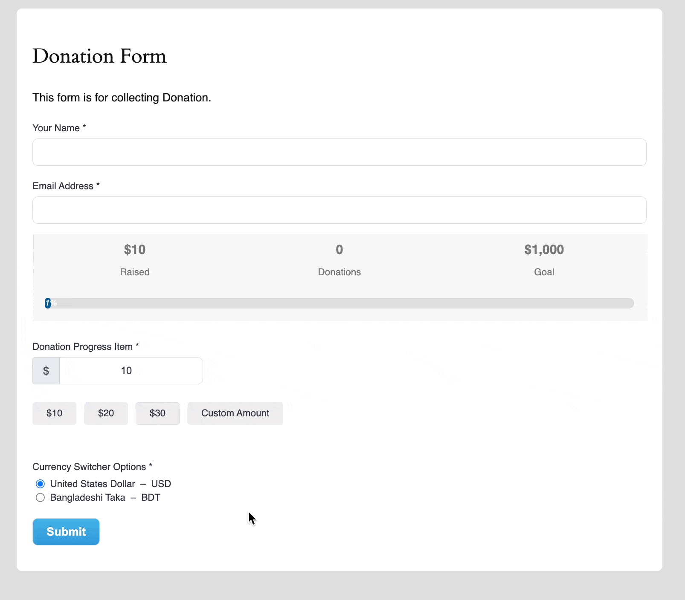

This way you can easily add the **Currency switcher** field in Paymattic Forms!
If you have any further questions, concerns, or suggestions, please do not hesitate to contact our [@support team](https://wpmanageninja.com/support-tickets/). Thank you.