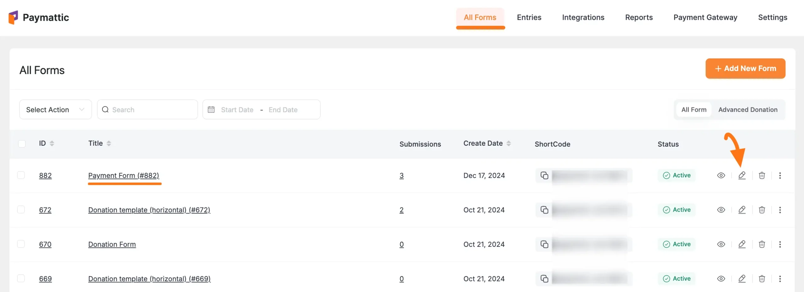
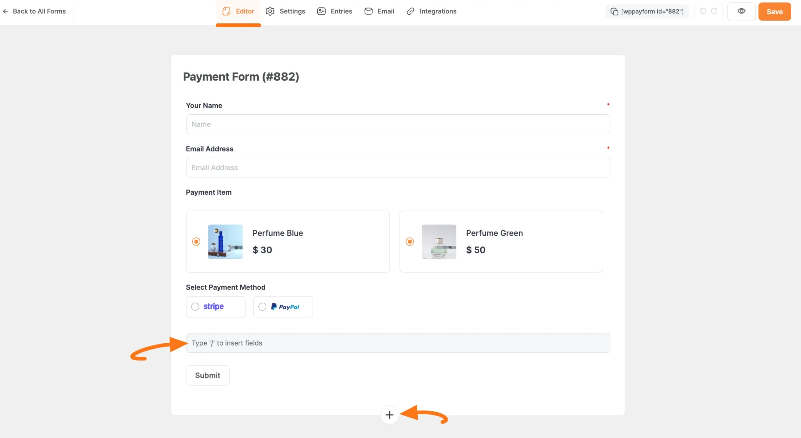
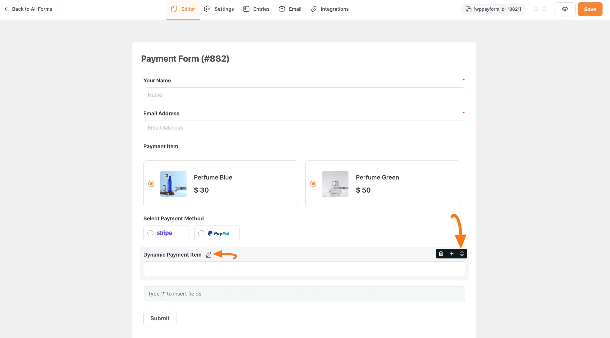
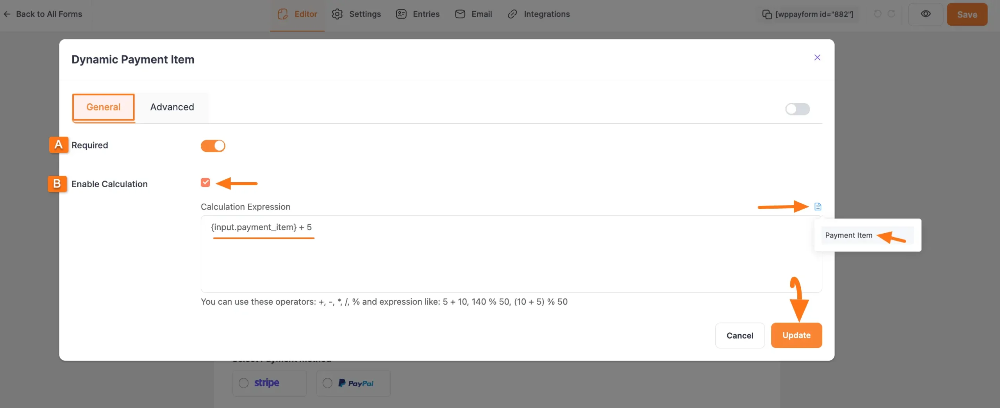
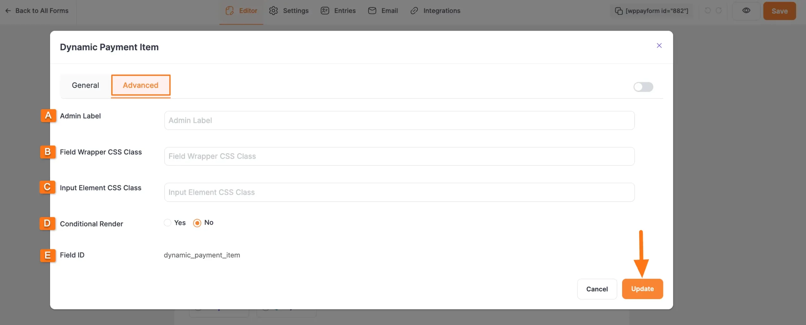
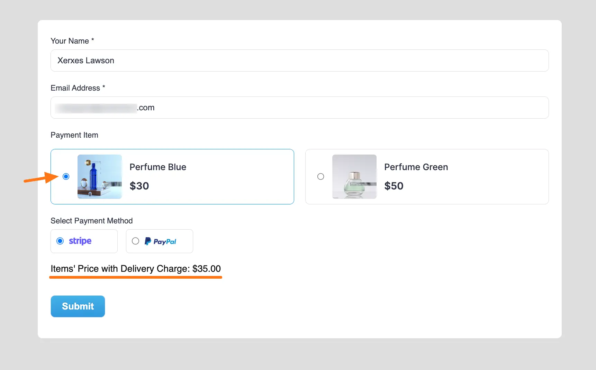

# Dynamic Payment Item Field 

In [Paymattic](https://paymattic.com/), the **Dynamic Payment Item,** an **in-built calculation feature** for **Number** and **Product** fields, allows users to perform real-time mathematical operations within any [Payment Form](./how-to-create-your-first-payment-form-in-a-minute-and-accept-payments-with-paymattic.md). 

This article will guide you on how to embed the **Dynamic Payment Item** field to the **WordPress Site** through **Paymattic**.

::: warning
Remember, **Dynamic Payment Item** is a premium feature and you need the [Paymattic Pro Plugin](./how-to-install-and-activate-paymattic-in-wordpress.md#1-toc-title) to use this field.
:::

## Adding Dynamic Payment Item Field 

To learn how to add the **Dynamic Payment Item** field to the **Paymattic Form** on your **WordPress Site**, follow the steps below –  

First, go to the **All Forms** section from the **Pymattic Navbar,** choose a **Form,** and click the **Pencil/Edit** icon to open the **Editor** page of that form.

::: tip
If you do not have any existing form, read the [Create a Form from Scratch](./how-to-create-a-form-from-scratch-with-paymattic.md) or [Create a Form using Templates](./simple-form-templates.md) documentation. For example, I choose an existing form to show the whole process. **For example**, I choose an existing form to show the whole process.
:::

Once you open the **Editor** page, add the necessary fields by typing the **"/"** or clicking the **Plus Icon** placed at the bottom.

::: warning
**Remember**, to add a **Payment Gateway** you must add at least one [**Product Field**](./how-to-add-payment-item-fields-in-wordpress-with-paymattic.md) field.
:::

For example, I choose the **Plus Icon** option to select the **Dynamic Payment Item** field under the **Donation & Product Fields** section from the **Choose Form Field** page.

::: tip
Also, don't forget to add a product field (e.g., [Payment Item](./how-to-add-payment-item-fields-in-wordpress-with-paymattic.md), or [Subscription Payment](./how-to-add-susbcription-payment-item-fields-in-paymattic.md) field) to make the Dynamic Payment Item field functional, along with a [Payment Method Field](./how-to-use-the-payment-method-fields-section.md) to collect payments.
:::

### Add Calculation Expression

Now, to make the added **Dynamic Payment Item** field functional for the desired calculation, you need to set up the **Calculation Expression** in the **Settings**.

**To learn how to set up the Dynamic Payment Item's Settings, follow the steps below –**

To add the **Calculation Expression** in the **Dynamic Payment Item** field according to your needs, click the **Settings Icon** from the right-side corner.

::: tip
You can also **Edit** the **Field Label** according to your needs using the **Pencil Icon** right next to the field name.
:::

Now, a pop-up page will appear with various settings options for customizing the field.

### General Settings 

All the Settings under the General Tab mentioned in the below screenshot are briefly explained:

**A. Required**: Enable this option to make this field mandatory for users to fill in for successful form submission.

**B. Enable Calculation**: Now, click the checkbox to enable the **Calculation Feature**. Then, add the desired equation under the **Calculation Expression** box to ensure what calculation you want to perform. 

First, click the **Document Icon** on the right side to add the available input fields on which you want to perform the calculation. Then, you can use the desired mathematical operators (+, -, *, /, %) in your expression. 

**For example**, in the screenshot below, you can see that I used the **"{input.payment_item} + 5"** as **Calculation Expression** to add a delivery charge to the items' price. As a result, when users select an item during form-filling, they will see both the original price and the total price (including the delivery charge) for the chosen item. 

Once you finish, click the **Update** button to save all your configuration.

### Advanced Settings 

Once you complete the General settings, go to the **Advanced** tab, and you will find some advanced settings for your **Dynamic Payment Item** field. These are:

**A. Admin Label**: This label is used for the admin who wants to see the field's label from the back end. 

**B. Field Wrapper CSS Class**: This is used for adding a Custom CSS/JS for an entire field of a specific form using the Field Wrapper CSS Class element. To learn more, click [here](./how-to-create-custom-css-js-in-wordpress-with-paymattic.md).

**C. Input Elements CSS Class**: This is used for adding a Custom CSS/JS for a specific input field of a form using the Input Elements CSS Class element. To learn more, click [here](./how-to-create-custom-css-js-in-wordpress-with-paymattic.md).

**D. Conditional Render**: You can set conditional logic to display the field in the form that will be triggered by specific actions taken on a previous input field. To learn more about conditional renderings, click [here](./how-to-use-conditional-logic-in-form-fields-with-paymattic.md).

**E. Field ID**: This option is used to add or track form fields. Plus, creating the custom CSS/JS for a specific form field.

Once you finish, click the **Update** button to save all your configuration.

## Embedding Form into Front-end

Here, you can see the **Dynamic Payment Item** field and other necessary fields are added to the form.

::: tip
You can edit their field name and settings. To learn more about form editing, read this [Documentation](./how-to-edit-forms-in-wordpress-with-paymattic.md#0-toc-title).
:::

Now, to embed and display the form on a specific Page/Post, **copy** this **Shortcode** and **paste** it into your desired **Page/Post**.

Once you complete the edit, press the **Save** button to save all the changes you made.
Also, to see the **Preview** of the form, click the **Eye** icon.

## Preview of the Dynamic Payment Item field

Here is the preview of the **Dynamic Payment Item** field in a Form.

You can see that when the user selects the Perfume Blue Item, the Dynamic Payment Item field instantly adds $5 to the original price and displays the price including the delivery charge.

### Supported Mathematical Expression

To learn more details about the use case of all available mathematical Operators supported by Paymattic to perform calculations, read the following table.

| Symbol | Explanation |
|--------|-------------|
| + | Addition Operator Use Case: 2+3 = 5 |
| – | Subtraction Operator Use Case: 2-3 = -1 |
| / | Division Operator Use Case: 3/2 = 1.5 |
| * | Multiplication Operator Use Case: 2*3 = 6 |
| % | Percentage Operator Use case: 100 % 10 = 10 |
| ( | Opening Parenthesis |
| ) | Closing Parenthesis |
| round | Make a number a decimal/integer. Use case: round(3.235723663, 2) = 3.24 and round(3.235723663, 0) = 3 |
| ceil | Use case: ceil(3.235723663) = 4 |
| floor | Use case: floor(3.235723663) = 3 |
| abs | Use case: abs(-4.6) = 4.6 |
| max | Use case: max(10, 15) = 15 |
| min | Use case: min(10, 15) = 10 |

This way you can easily add the **Dynamic Payment Item** fields in Paymattic Forms!
If you have any further questions, concerns, or suggestions, please do not hesitate to contact our [@support team](https://wpmanageninja.com/support-tickets/). Thank you.