# How to Add Coupon Field in WordPress with Paymattic

In [Paymattic](https://paymattic.com/), the **Coupons** feature allows you to add coupons and apply discounts to your payment form. This article will guide you through adding as many coupons as you need in your WordPress site for your Paymattic forms.

::: warning
**The Coupon** field is a premium feature and you need the [**Paymattic Pro Plugin**](./how-to-install-and-activate-paymattic-in-wordpress.md#1-toc-title) to use this field.
:::

## Creating Coupon

To learn how to create/add a **Coupon** field in Paymattic, follow the steps with the screenshots below – 

First, go to **Settings** from the **Paymattic Navbar**, click the **Coupons** tab from the left sidebar, and click the **+ Add New Coupon** button. 

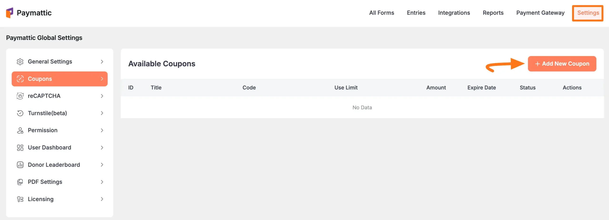

Now, fill in all the necessary information, click the **Save Coupon** button, and the coupon will be created.

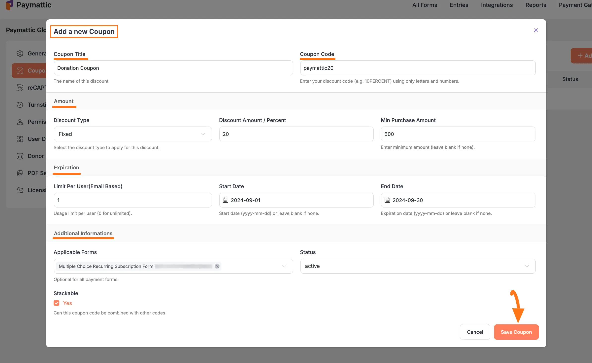

**All the options mentioned above to set up your Coupon are briefly explained below –**

### Coupon Title & Code

- **Coupon Title**: Add a name for your coupon into this field. 

- **Coupon Code**: Put your coupon code in the Coupon Code box, such as paymattic20. You can add only alphabets or numbers as coupon codes. 

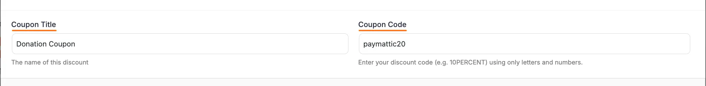

### Amount

- **Discount Type**: Here, you can select your discount type either based on Percent or a fixed amount.

- **Discount Amount/Percent**: Here, enter the amount/percent you want to give a Discount to your coupon users.

- **Min Purchase Amount**: This specifies the minimum amount that must be purchased to receive any discount. Leave blank if there is no minimum amount requirement.

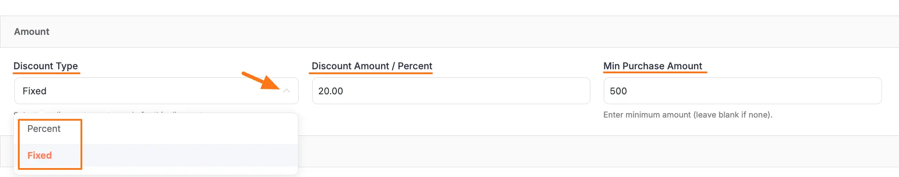

### Expiration

- **Limit per user (Email Based)**: Here, you can set the number of times a specific user can use this coupon. Leave this field empty or enter zero if no limits are needed.

- **Start Date**: Enter the start date for this coupon code in the format of yyyy-mm-dd from. Leave blank if there is no start date.

- **End Date**: Enter the end date for this coupon code in the format of yyyy-mm-dd as an expiry date i.e., after that, this coupon code will not work. Leave blank if there is no end date. 

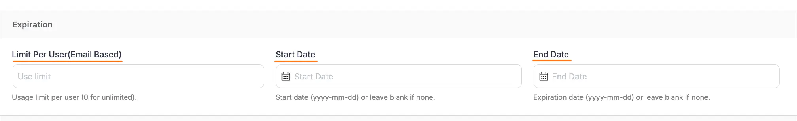

### Additional Information 

- **Applicable Forms**: Here, you can select the Form where this coupon code will be applicable. Leave this blank if you want to apply this coupon code or all forms

- **Status**: Here you can set the Coupon status as Active or Inactive.

- **Stackable**: Check this **Yes** box if you want this coupon code to be used with other coupon codes.

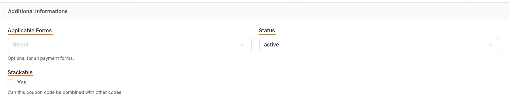

## Adding Coupon Field in Forms

Once you have successfully created your coupon code field, it's time to integrate this coupon code with your payment form.

First, go to **All Forms** from the **Paymattic Navbar,** choose the form you wish to work on, and click the **Pencil/Editor** icon, e.g., I choose the Donation form to show the process.

::: tip
If you do not have any existing forms, read the [Create a Form from Scratch](./how-to-create-a-form-from-scratch-with-paymattic.md) or [Create a Form using Templates](./simple-form-templates.md) documentation.
:::

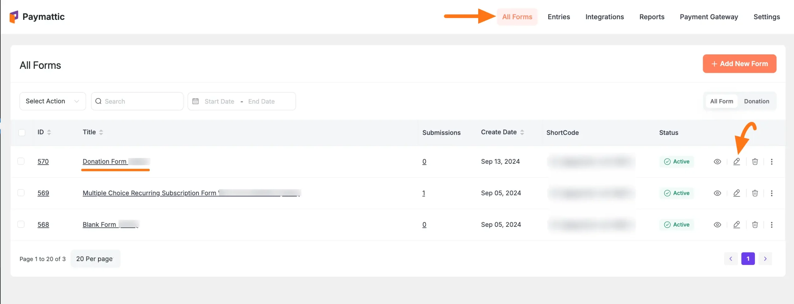

Click the **Plus Icon** to add a new field to your form.

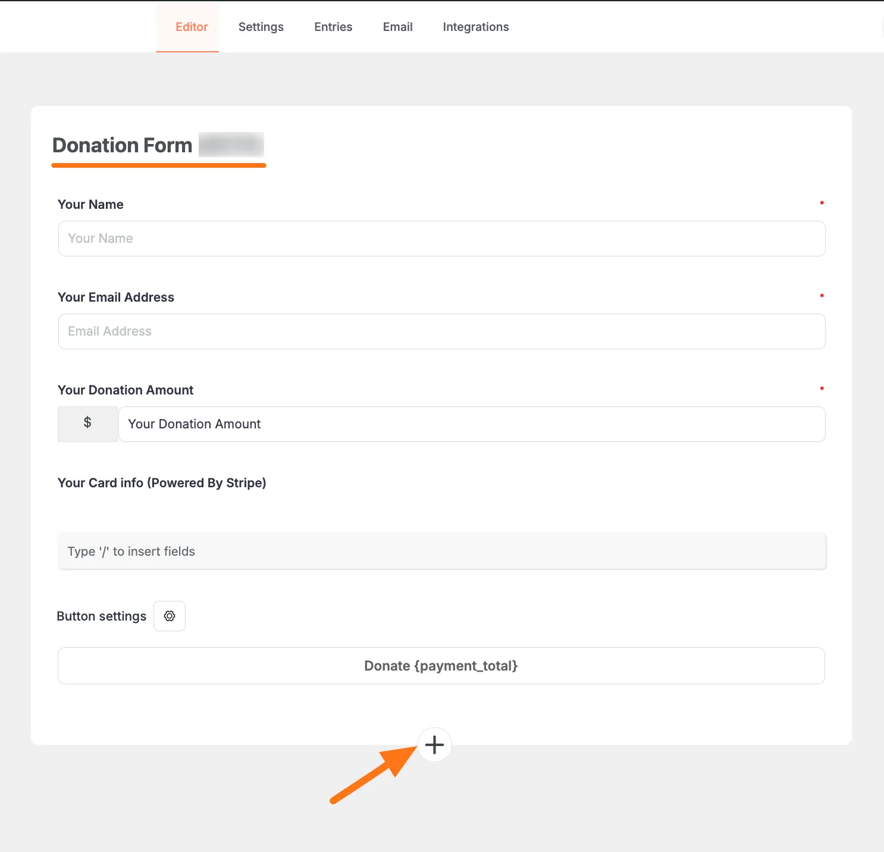

Now click the **Coupon** field under the **Donation & Product Fields** section.

::: warning
Remember, the **Coupon** field is a **Pro feature**. So, to use this field in your form, you must have the [Paymattic Pro Plugin](./how-to-install-and-activate-paymattic-in-wordpress.md).
:::

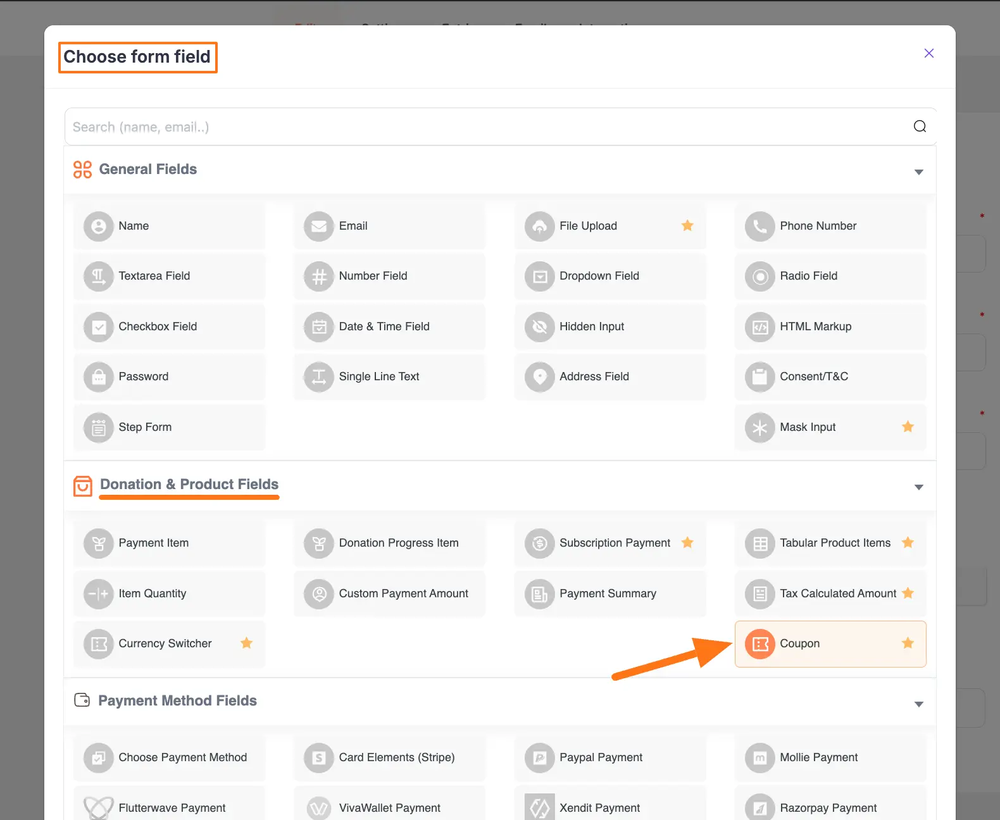

You can see the previously created coupon field is added to the form.

Finally, click the **Save** button to save all changes you made.
To see the preview, click the **Eye Icon** placed right before the Save button.

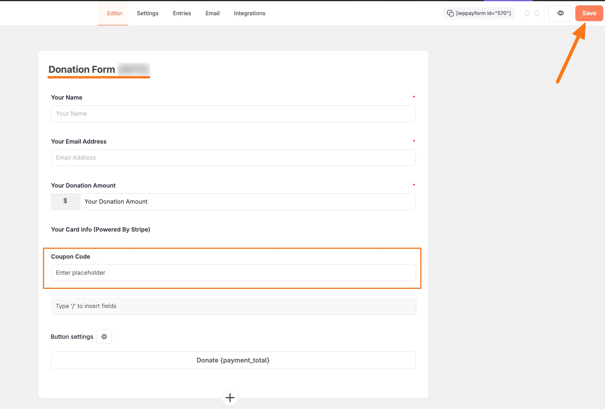

## Preview of Coupon Field

Here, is the preview of the added Coupon Code field under the Donation Form.

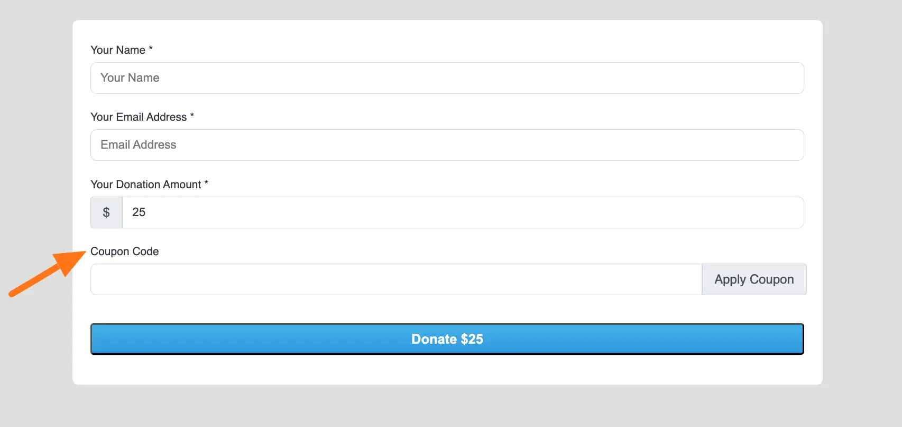

This way you can easily add a Coupon Code field for your payment form!
If you have any further questions, concerns, or suggestions, please do not hesitate to contact our [@support team](https://wpmanageninja.com/support-tickets/). Thank you.