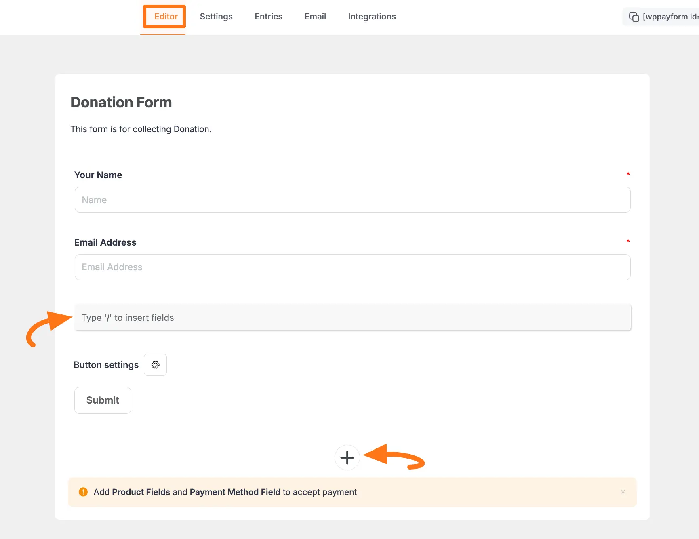

# How to Add Tax Calculated Amount Field in WordPress with Paymattic?

In [Paymattic](https://paymattic.com/), the **Tax Calculated Amount** field allows you to automatically generate tax amounts for an item. This article will guide you on how to embed the Tax Calculated Amount field to the WordPress Site through Paymattic.

<iframe width="560" height="315" src="https://www.youtube.com/embed/ed0RtdxCdz4?list=PLXpD0vT4thWH80g5e9wYnoBMgEqUXbr53" title="Tax Calculated Amount Field Tutorial" frameborder="0" allow="accelerometer; autoplay; clipboard-write; encrypted-media; gyroscope; picture-in-picture" allowfullscreen></iframe>

::: warning
**Tax Calculated Amount** is a premium feature and you need the [**Paymattic Pro Plugin**](./how-to-install-and-activate-paymattic-in-wordpress.md) to use this field.
:::

## Adding Tax Calculated Amount Field

To learn how to add the **Tax Calculated Amount** to the Paymattic Form on your WordPress site, follow the steps with the screenshots below –  

First, go to the **All Forms** section from the **Pymattic Navbar,** choose a **Form,** and click the **Pencil/Edit** icon to open the **Editor** page of that form.

::: tip
If you do not have any existing forms, read this [Create a Form from Scratch](./how-to-create-a-form-from-scratch-with-paymattic.md) or [Create a Form using Templates](./simple-form-templates.md) documentation to create one.
:::

For example, I choose an existing form to show the whole process.

Once you open the **Editor** page, add the **Tax Calculated Amount** field by typing the **"/"** or clicking the **Plus Icon** placed at the bottom.

::: warning
We always suggest you keep the [**Name**](./how-to-use-general-form-input-fields-in-wordpress-with-paymattic.md#5-toc-title) and [**Email**](./how-to-use-general-form-input-fields-in-wordpress-with-paymattic.md#6-toc-title) field at the beginning of any Form.
:::

For example, I choose the **Pluc Icon** option to select the **Tax Calculated Amount** field under the **Donation & Product Fields** section from the **Choose Form Field** page.

::: warning
Also, don't forget to add a [**Payment Item Field**](./how-to-add-payment-item-fields-in-wordpress-with-paymattic.md) for making the **Tax Calculated Amount** field functional and a [**Payment Method Field**](./how-to-use-the-payment-method-fields-section.md) for collecting payments.
:::

## Editing/Customizing the Field

You can see the **Tax Calculated Amount** and other necessary fields added to the form.

::: tip
You can edit their field name and settings. To learn more about form editing, read this [Documentation](./how-to-edit-forms-in-wordpress-with-paymattic.md).
:::

Specifically, to edit the **Tax Calculated Amount** field according to your needs, click the **Settings Icon** from the right-side corner.

Now, a pop-up page will appear with various settings options for customizing the field. 

### General Settings 

All the Settings under the General Tab mentioned in the below screenshot are briefly explained:

- **Tax Percentage:** Here, you can set the percentage of the total tax required to pay for the added item/s in your form.

- **Target Product Item**: You need to select the **Payment Item** from the item/s added to your form for which you want to use this Tax Calculated Amount field.

::: warning
Remember, ensure that you use a separate **Tax Calculated Amount** field for each **Payment Item** field.
:::

Once you finish, click the **Update** button to save all your configuration. 

### Advanced Settings 

Once you complete the General settings, go to the **Advanced** tab, and you will find some advanced settings for your Payment Item field. These are:

- **Admin Label**: This label is used for the admin wants to see the field's label from the back end.

- **Field Wrapper CSS Class**: This is used for adding a Custom CSS/JS for an entire field of a specific form using the Field Wrapper CSS Class element. To learn more, click [here](./how-to-create-custom-css-js-in-wordpress-with-paymattic.md).

- **Input Elements CSS Class**: This is used for adding a Custom CSS/JS for a specific input field of a form using the Input Elements CSS Class element. To learn more, click [here](./how-to-create-custom-css-js-in-wordpress-with-paymattic.md).

- **Field ID**: This option is used for adding or tracking form fields. Plus, creating the custom CSS/JS for a specific form field.

Once you finish, click the **Update** button to save all your configuration. 

## Embedding Form into Frontend

Here, you can see the **Tax Calculated Amount** field and other necessary fields are added to the form.

Now, to embed and display the form on a specific Page/Post, **copy** this **Shortcode** and paste it into your desired Page/Post.

Once you complete the edit, press the **Save** button to save all the changes you made. And, to see the **Preview** of the form, click the **Eye** icon.

## Preview of Tax Calculated Amount field

Here is the preview of the **Tax Calculated Amount** field in a Form.

This way you can easily add the **Tax Calculated Amount** field in Paymattic Forms!
If you have any further questions, concerns, or suggestions, please do not hesitate to contact our [@support team](https://wpmanageninja.com/support-tickets/). Thank you.