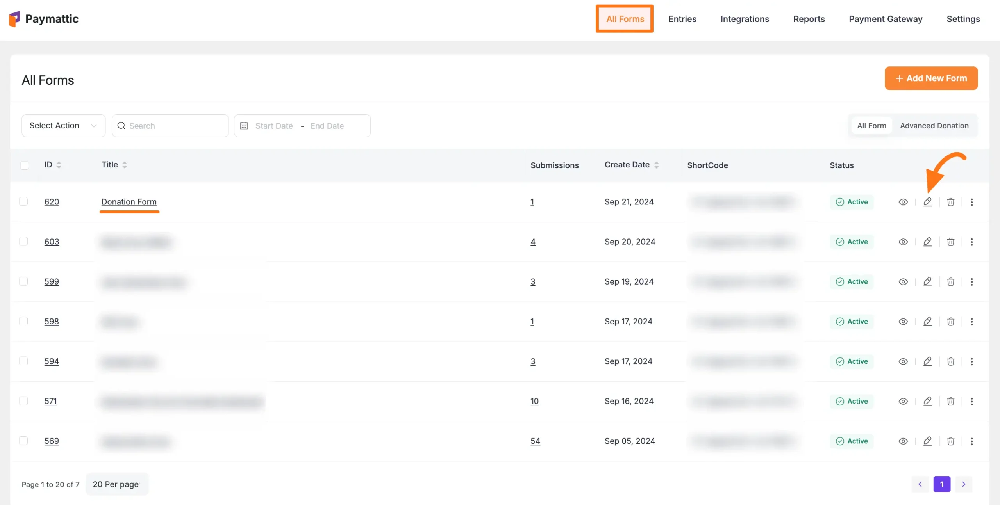
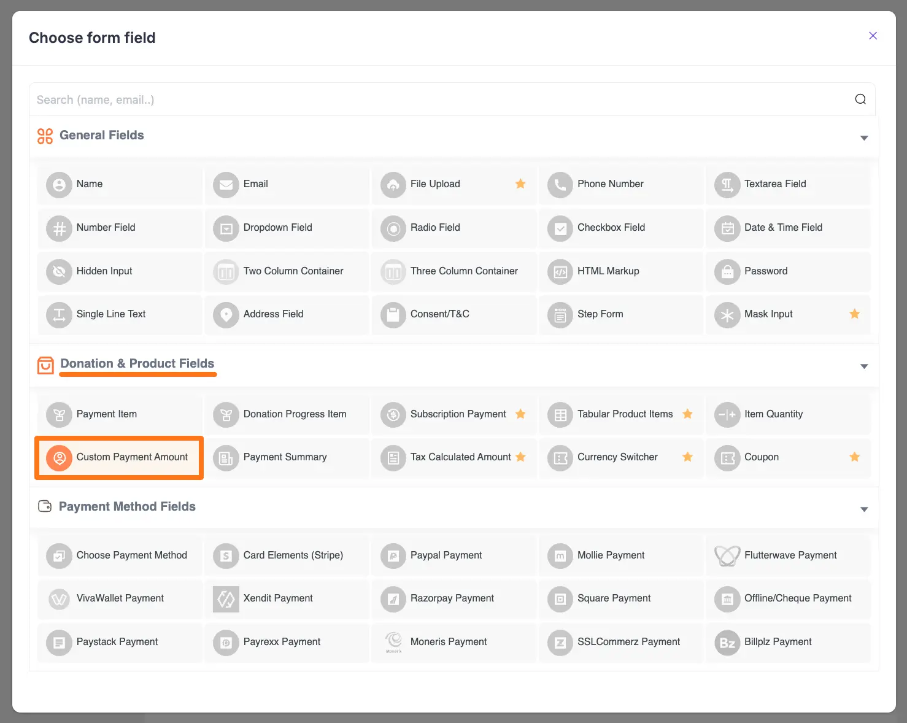
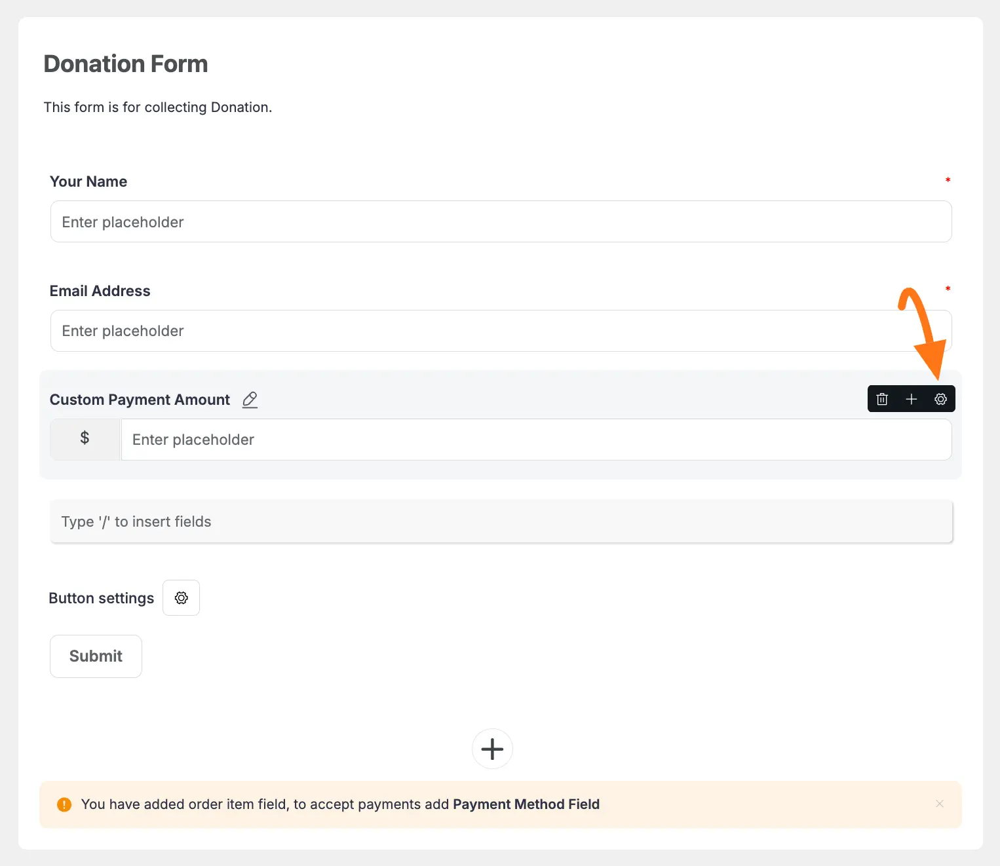
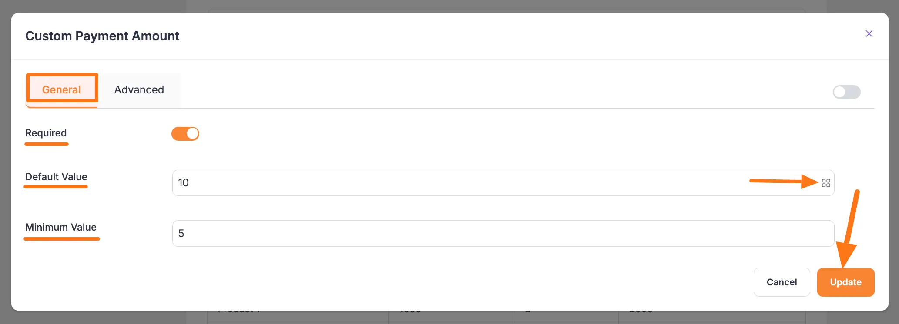
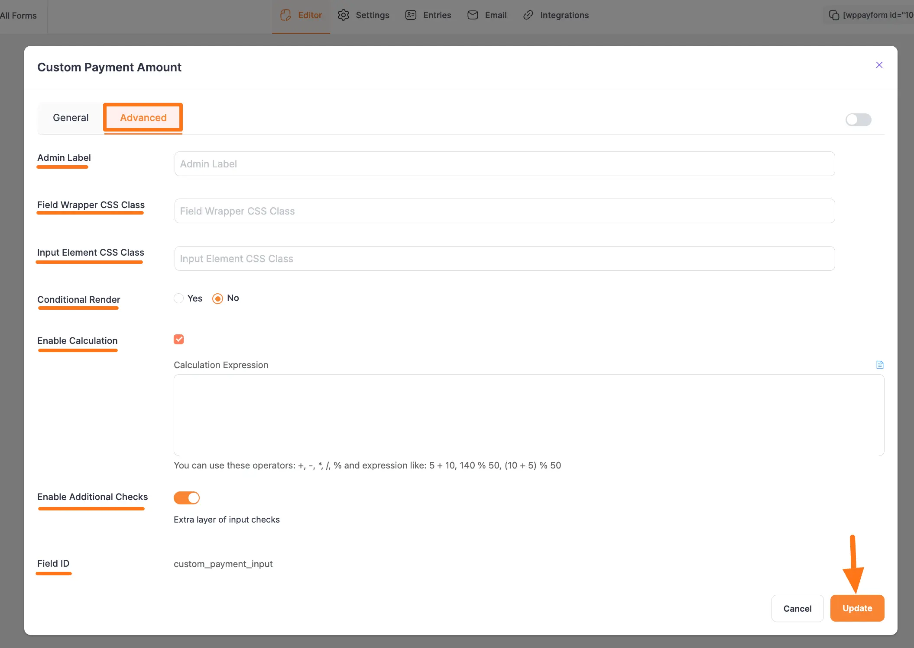
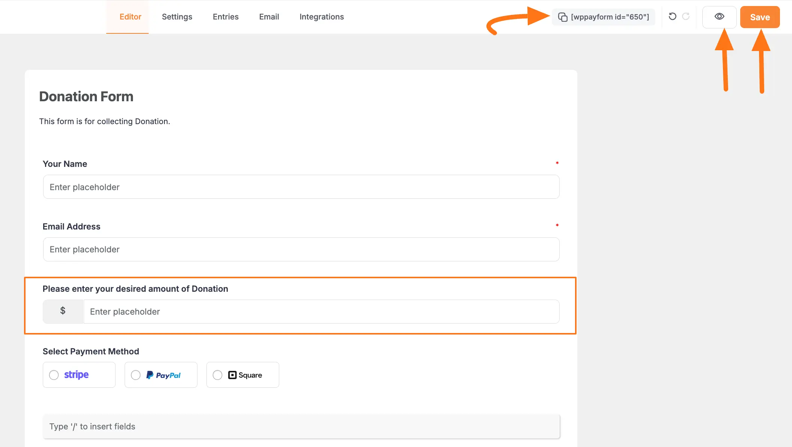
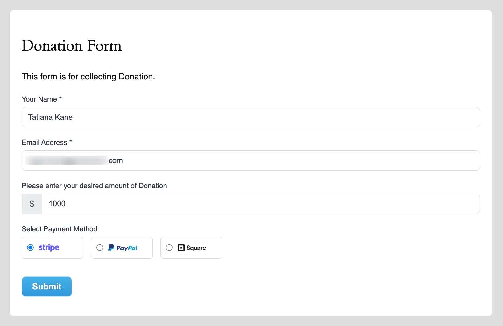

# How to Add Custom Payment Amount Field in WordPress with Paymattic?

In [Paymattic](https://paymattic.com/), the **Custom Payment Amount** field allows users to pay any amount based on their needs. This article will guide you on how to embed the Custom Payment Amount field to the WordPress Site through Paymattic.

## Adding Custom Payment Amount Field

To learn how to add the Custom Payment Amount field to the Paymattic Form on your WordPress site, follow the steps with the screenshots below –

First, go to the **All Forms** section from the **Pymattic Navbar,** choose a **Form,** and click the **Pencil/Edit** icon to open the **Editor** page of that form.

::: tip
If you do not have any existing form, read this [Create a Form from Scratch](./how-to-create-a-form-from-scratch-with-paymattic.md) or [Create a Form using Templates](./simple-form-templates.md) documentation to create one. **For example**, I choose an existing form to show the whole process.
:::

Once you open the **Editor** page, add the **Custom Payment Amount** fields by typing the **"/"** or clicking the **Plus Icon** placed at the bottom.

::: warning
We always suggest you keep the [**Name**](./how-to-use-general-form-input-fields-in-wordpress-with-paymattic.md#5-toc-title) and [**Email**](./how-to-use-general-form-input-fields-in-wordpress-with-paymattic.md#6-toc-title) field at the beginning of any Form.
:::

For example, I choose the **Pluc Icon** option to select the **Custom Payment Amount** field under the **Donation & Product Fields** section from the **Choose Form Field** page.

::: warning
Also, do not forget to add a [**Payment Method Field**](./how-to-use-the-payment-method-fields-section.md) for collecting payments.
:::

## Editing/Customizing the Field

You can see the **Custom Payment Amount** and other necessary fields added to the form.

::: tip
You can edit their field name and settings. To learn more about form editing, read this [Documentation](./how-to-edit-forms-in-wordpress-with-paymattic.md).
:::

Specifically, to edit the **Custom Payment Amount** field according to your needs, click the **Settings Icon** from the right-side corner.

Now, a pop-up page will appear with various settings options for customizing the field.

### General Settings 

All the Settings under the General Tab mentioned in the below screenshot are briefly explained:

- **Required**: Enable this option to make this field mandatory for users to fill in for a successful submission.

- **Default Value**: You can set the default amount for your users and use **Smartcode** like {querystring:YOUR_KEY} by clicking the **Shortcode Icon**.

- **Minimum Value**: With this option, you can specify the minimum amount users must pay.

Once you finish, click the **Update** button to save all your configuration.

### Advanced Settings 

Once you complete the General settings, go to the **Advanced** tab, and you will find some advanced settings for your **Custom Amount** field. These are:

- **Admin Label**: This label is used for the admin wants to see the field's label from the back end.

- **Field Wrapper CSS Class**: This is used for adding a Custom CSS/JS for an entire field of a specific form using the Field Wrapper CSS Class element. To learn more, click [here](./how-to-create-custom-css-js-in-wordpress-with-paymattic.md).

- **Input Elements CSS Class**: This is used for adding a Custom CSS/JS for a specific input field of a form using the Input Elements CSS Class element. To learn more, click [here](./how-to-create-custom-css-js-in-wordpress-with-paymattic.md).

- **Conditional Render**: You can set conditional logic to display the field in the form that will be triggered by specific actions taken on a previous input field. To learn more about conditional renderings, click [here](./how-to-use-conditional-logic-in-form-fields-with-paymattic.md).

- **Enable Calculation**: Enabling this feature wil allow you to perform real-time mathematical operations for the **Number** and **Product** fields within any [Payment Form](./how-to-create-your-first-payment-form-in-a-minute-and-accept-payments-with-paymattic.md). Now, add the desired equation under the **Calculation Expression** box to ensure what calculation you want to perform. To know the detailed guidelines of this **Calculation Feature**, read this [Documentation](./dynamic-payment-item-field.md#2-toc-title).

- **Enable Additional Checks**: Enable this option to set an extra layer of data integrity check.

- **Field ID**: This option is used for adding or tracking form fields. Plus, creating the custom CSS/JS for a specific form field.

Once you finish, click the **Update** button to save all your configuration.

## Embedding Form into Frontend

Here, you can see the **Custom amount** field and other necessary fields are added to the form.

Now, to embed and display the form on a specific Page/Post, **copy** this **Shortcode** and paste it into your desired Page/Post.

Once you complete the edit, press the **Save** button to save all the changes you made. And, to see the **Preview** of the form, click the **Eye** icon.

## Preview of Custom Payment Amount field

Here is the preview of the **Custom Payment Amount** field in a Form.

This way you can easily add the **Custom Payment Amount** field in Paymattic Forms!
If you have any further questions, concerns, or suggestions, please do not hesitate to contact our [@support team](https://wpmanageninja.com/support-tickets/). Thank you.