We often receive inquiries about adding the **First Name** and **Last Name** fields separately, horizontally or vertically, in a Payattic Form. This article will guide you through adding the First and Last Name fields in the [Paymattic form](http://paymattic.com).

## Adding First & Last Name Fields

To learn the process of first name and last name fields in a form, follow the steps with the screenshots below –

Open your **Desired Form** where you wish to add the **First** & **Last Name** fields.

If you do not have any existing forms, read this [Create a Form from Scratch](../form-editor/how-to-create-a-form-from-scratch-with-paymattic.md) or [Create a Form using Templates](../form-editor/simple-form-templates.md) documentation to create one.

For example, here, I used an existing blank form to show the whole process.

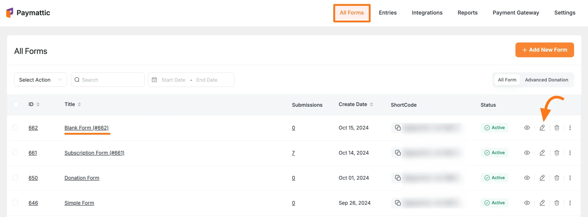

Once you open the **Editor** page, add the necessary fields by typing the **" / "** or clicking the **Plus Icon** placed at the bottom.

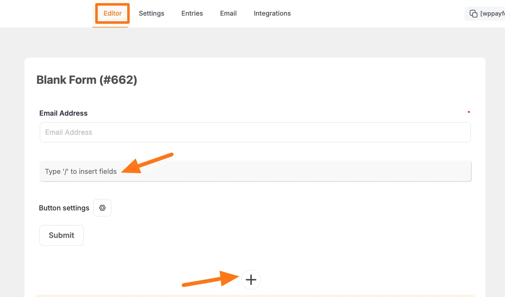

Now, from the [General Fields](../general-input-fields/how-to-use-general-form-input-fields-in-wordpress-with-paymattic.md) section, you can either choose the **Two Column Container** field to display two different fields horizontally or select the **Name** field twice to show them vertically.

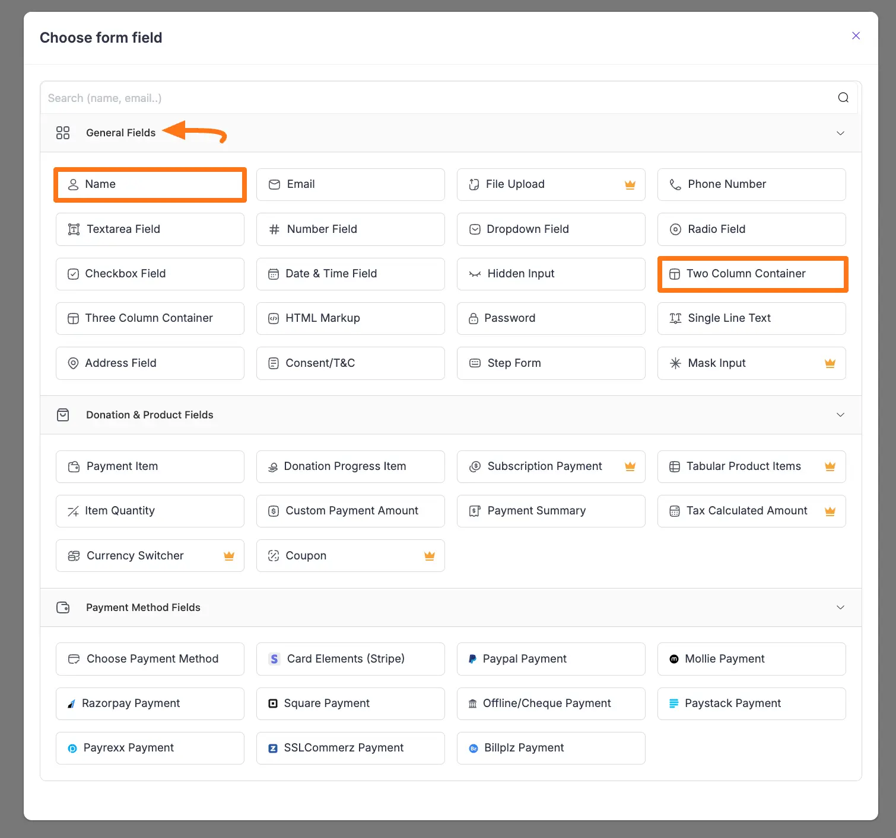

For example, I chose the **Two Column Container** field under the **General Fields** section to display the First and Last Name fields in one frame horizontally.

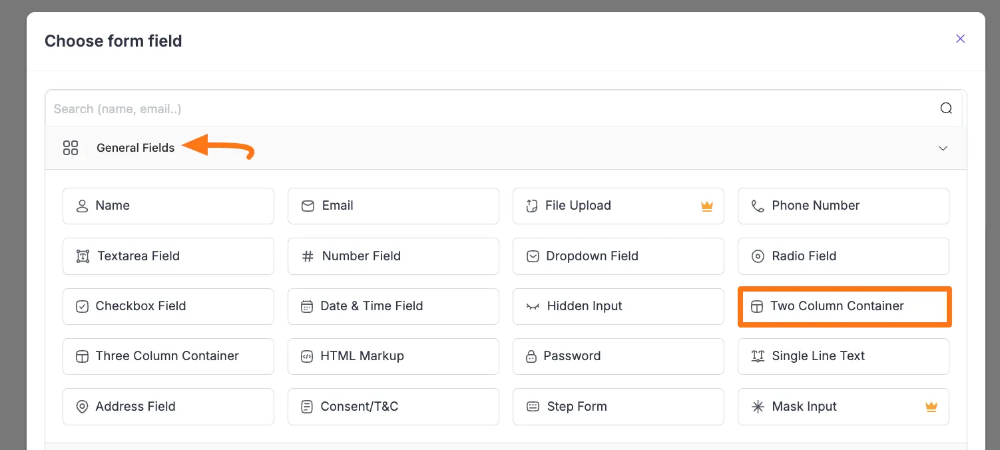

Here, you can see two columns are added.
Now, you can separately add **Name** fields **Two Times** inside these **Two Added Columns**.

To add **Name** fields, click the **Plus Icon** of each column.

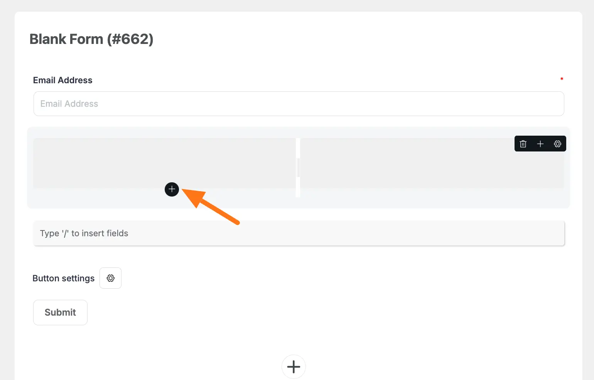

Once you click the **Plus** **Icon**, it will redirect you again to the **Choose form field** page from where select the **Name** field options and it will be added to your form.

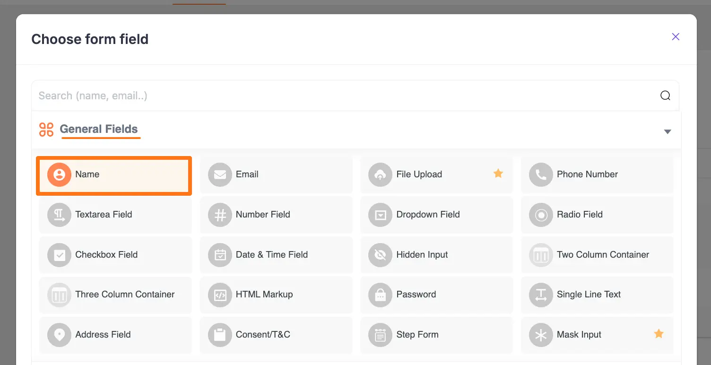

## Customizing the Added Fields

After adding the fields, **change the name** **of the fields** from **Your Name** to **First Name** and **Last Name** respectively by clicking the **Pencil/Edit** icon.

"**Remember**, to ensure the fields function properly, **you need to change the field names** at the **Admin Label** in the **Advanced** **Settings** of the **Name** field as well. 

If you do not change the names in the Admin Label, you will not see the added name fields separately (e.g., in the Entries, PDF file, and overall Admin backend) except the form preview only."

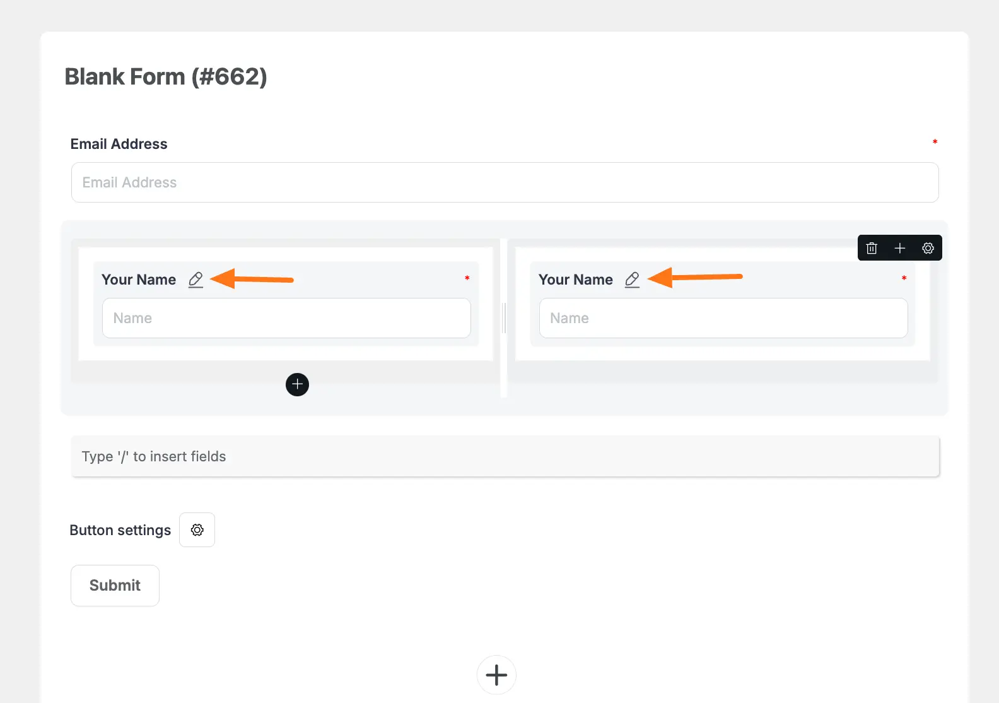

To change the name in the **Admin** **Label**, click the **Settings** **Icon** of the **Name** fields.

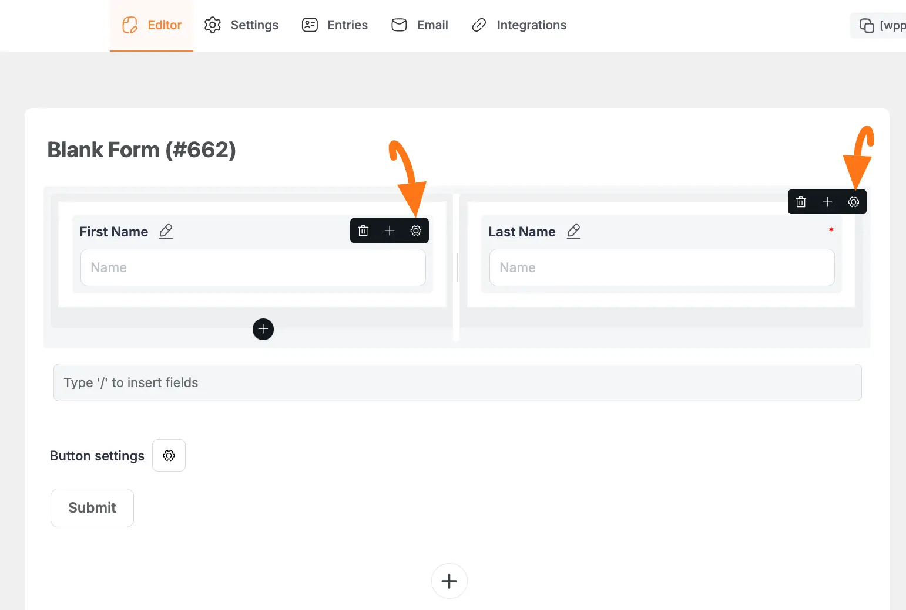

Now, go to the **Advanced** **Settings**, write the desired name in the **Admin** **Label** box, and click the **Update** button.

For example, here, I wrote First Name for the First Name field.

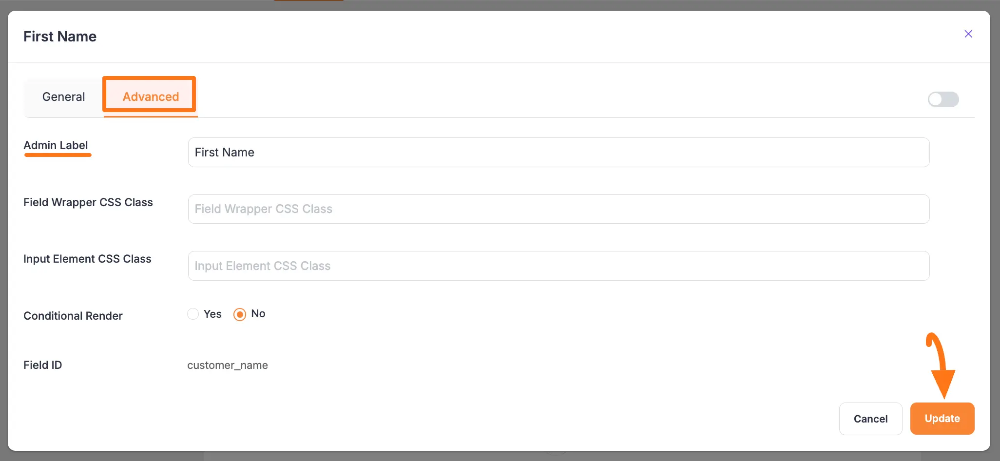

To learn more details about the customization of the added **Two Colum Container** field, **Name** field, and **Advanced** **Settings**, refer to the articles below –
- [Two Column Container](../form-editor/add-multiple-column-containers-in-forms.md)
- [Name](../general-input-fields/how-to-use-general-form-input-fields-in-wordpress-with-paymattic.md#name-fields)
- [Advanced Settings of Name field](../form-editor/how-to-use-conditional-logic-in-form-fields-with-paymattic.md)

## Preview of Added Fields

Once you change the fields' names from **Your Name** to **First Name** and **Last Name** respectively, press the **Save** button to save all the changes.

If you want to see the **Preview** of the form, click the **Eye** icon.

Also, to embed and display the form on a specific Page/Post, **copy** this **Shortcode** and paste it into your desired Page/Post.

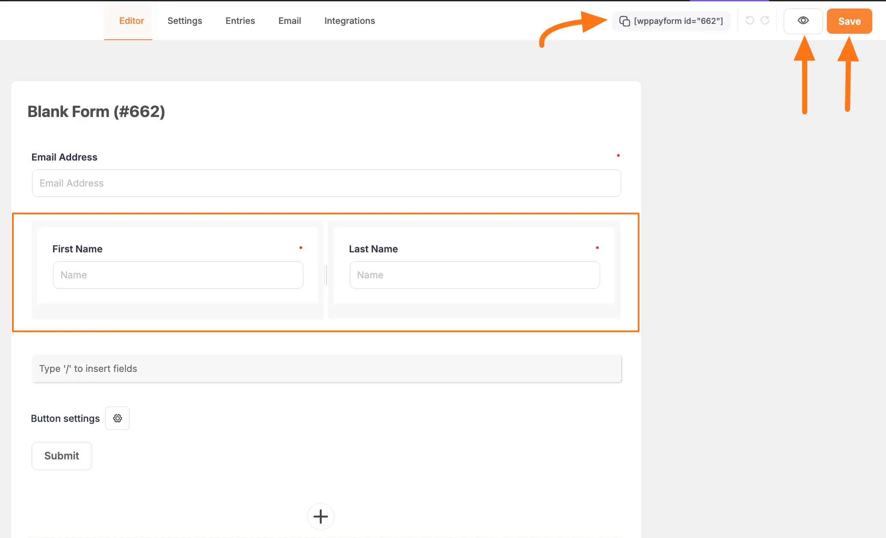

Here, you can see the preview of the separately added First Name and Last Name fields.

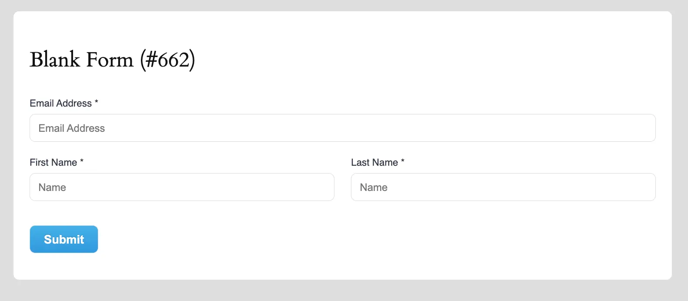

This way you can easily add the First & Last Name fields separately in Paymattic Forms!
If you have any further questions, concerns, or suggestions, please do not hesitate to contact our [support team](https://wpmanageninja.com/support-tickets/). Thank you.