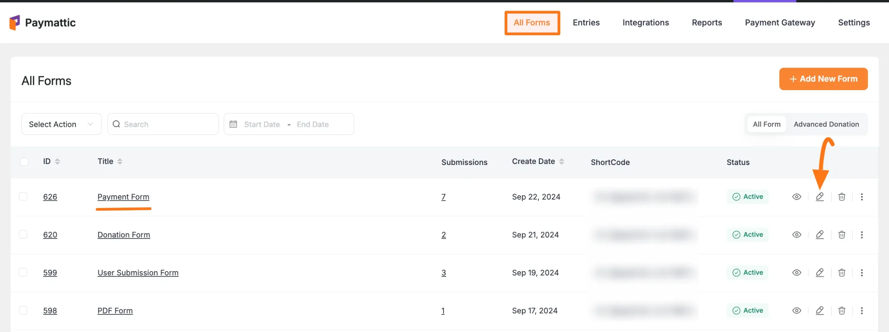
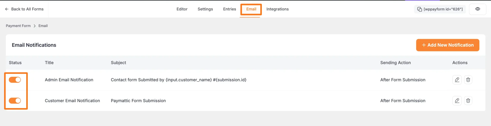
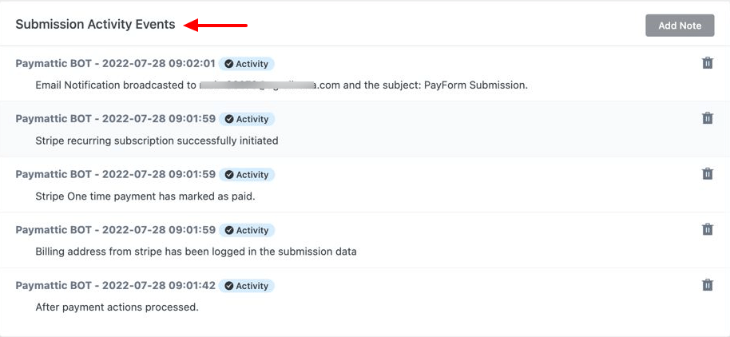
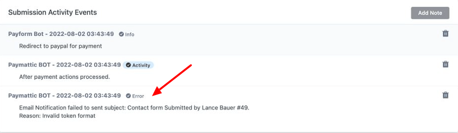
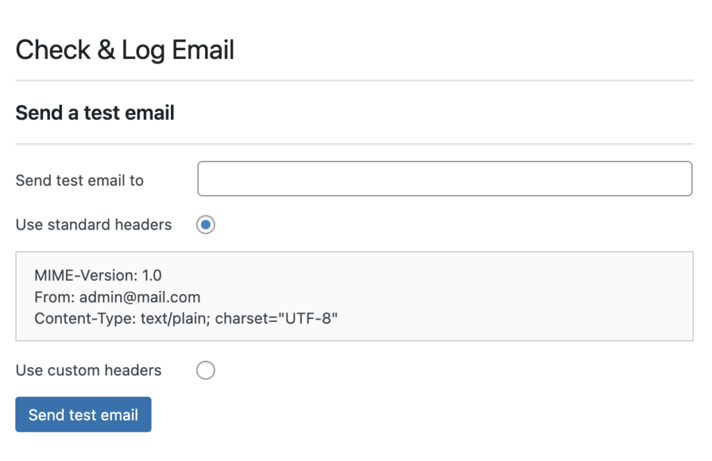

We often face queries that Paymattic is not sending email confirmations to admin. However, the issue is not related to Paymattic and it's very simple to fix the WordPress email not sending issue. Several factors can contribute to email deliverability issues. Follow the article carefully to solve email delivery issues with Paymattic notification emails.

1. Check if the Email Notification is Enabled
2. Check the Paymattic Submission Activity Log
3. Test Email Functionality on your Server
4. SMTP for Emails

## Check if the Email Notification is Enabled

Please, make sure you have configured the **Email notification Feed** properly on your Paymattic Site by following this [Documentation](../email-notification-settings/how-to-setup-email-notifications-in-paymattic-wordpress-plugin.md).

First, you should check whether the Email Notification option is enabled.

To check the Email Notification, g**o to**  **All Forms** from the **Paymattic Navbar**, and open the desired form by clicking the **Pencil/Edit** icon.

Then, go to the Email tab from the top bar of the form Editor page, and ensure the Toggle button of your added Email Notification Feed/s are enabled.

## Check The Paymattic Submission Activity Log

- Go to **Entries** of the particular form and select an entry to check the submission activity log.
- If the email is successfully triggered then you will see a message as **Email Notification broadcasted to**. This means the email is successfully triggered and Paymattic is working as it should.

If the form was unable to trigger the email notification you will see an error message like the below screenshot -

## Test Email Functionality on your Server

If there is any issue with your server configuration it will show you the message "**unable to send email error in API log,**" and to fix the issue you should test the email sending function on your server.
- To test the email-sending functionality to install and activate the **Check & Log Email plugin**.
- After activating the plugin go to **Check & Log Email** from your WordPress dashboard.
- Enter an email address to where the test email will be sent.

Now, check the inbox whether you received the test mail. Do not forget to check the spam or junk folder. If you receive the test email that means WordPress is successfully sending emails from your web server. If WordPress fails to send an email then contact your hosting provider to fix the issue.

## SMTP for Emails

We always recommend using SMTP for better email deliverability. An SMTP plugin can tell WordPress to use an external SMTP server like Amazon SES, MailGun, SendGrid, etc. for emailing. If you have dedicated hosting that includes email hosting, you can easily configure the hosting's SMTP with an SMTP plugin.

You can try out [Fluent SMTP](https://wordpress.org/plugins/fluent-smtp/), which is a free SMTP plugin you can use that does not require any license!

Fluent SMTP handles email deliverability in real time. It is the perfect solution for WordPress email not sending issues. All of your emails will reach the user's inbox while maintaining optimal performance. Fluent SMTP can deliver any chunk of emails using your SMTP server. Fluent SMTP will help you deliver emails even if they somehow get blocked, by resending the emails. To learn more about using FluentSMTP please take a look at the below video.

https://youtu.be/Je0OPk1NnjI 

If you have any further questions, concerns, or suggestions, please do not hesitate to contact our [support team](https://wpmanageninja.com/support-tickets/). Thank you.