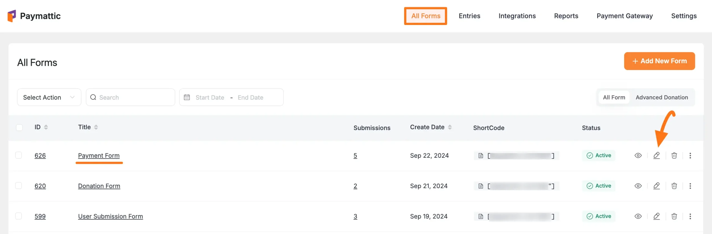
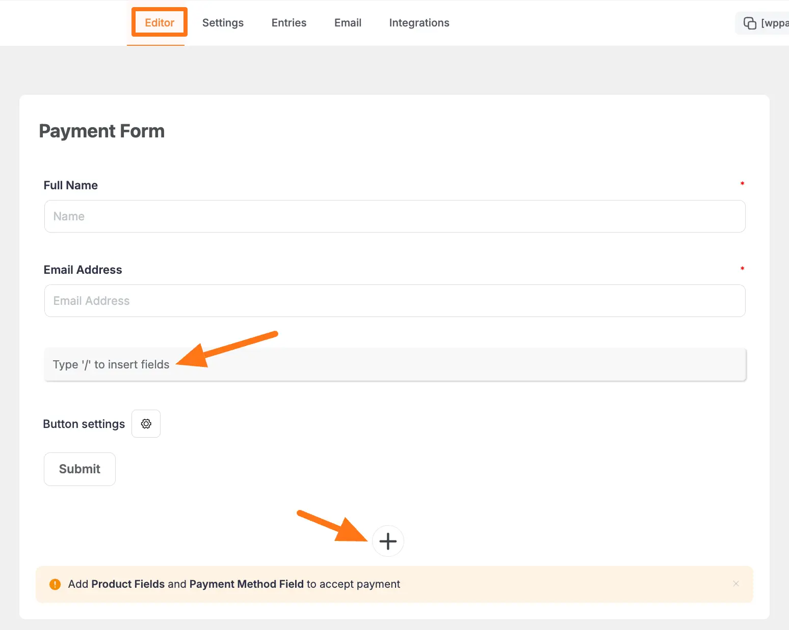
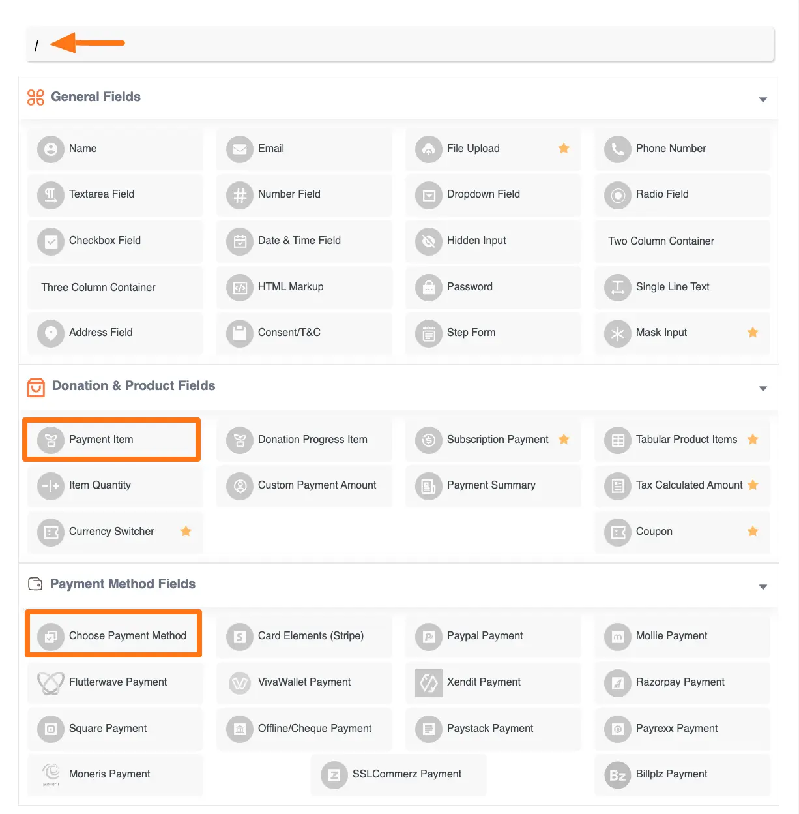
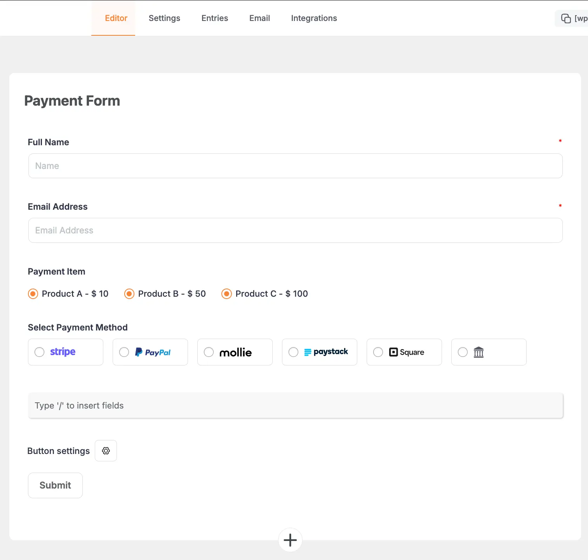
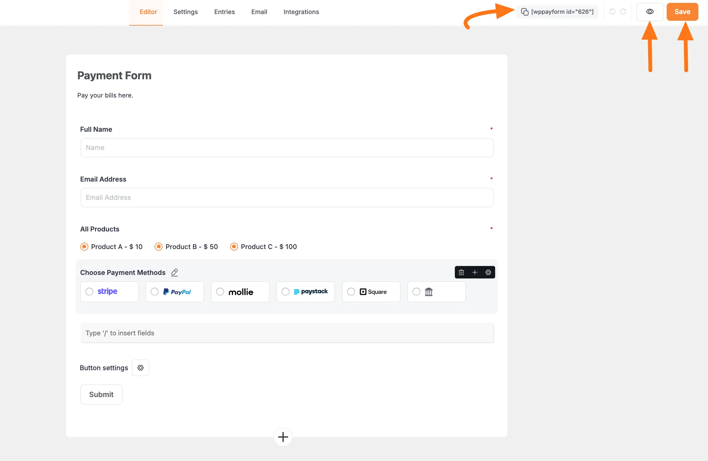
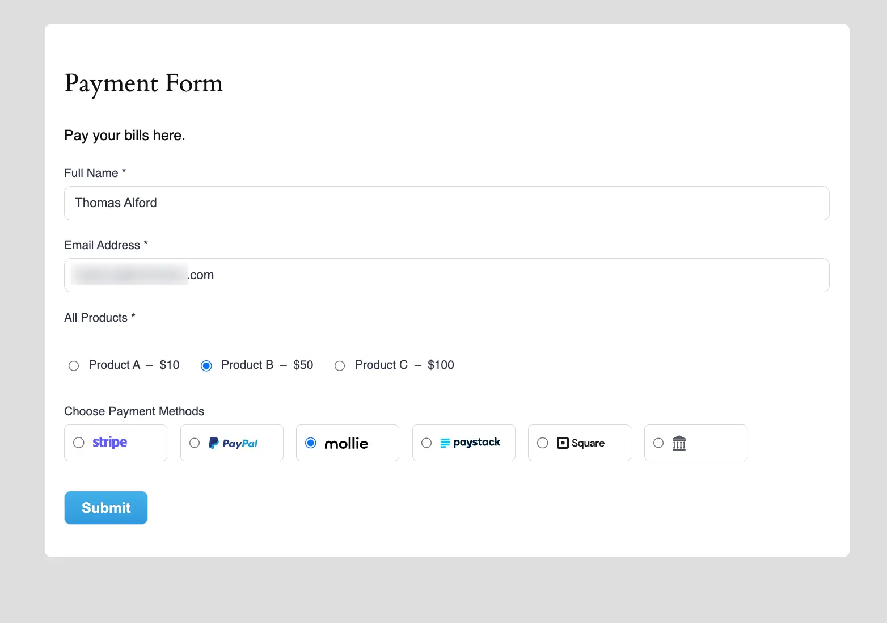

In [Paymattic](https://paymattic.com/), you can easily create **Step Forms** to accept payment through different platforms. This article will guide you through Creating Payment Forms to Collect Payments.

## Creating A Payment Form 

To learn how to create Payment Forms with Paymattic, follow the steps with the screenshots below –

First, go to the **All Forms** section from the **Paymattic Navbar,** choose a **Form,** and click the **Pencil/Edit** icon to open the **Editor** page of that form.

If you do not have any existing forms, read this [Create a Form from Scratch](../form-editor/how-to-create-a-form-from-scratch-with-paymattic.md) or [Create a Form using Templates](../form-editor/simple-form-templates.md) documentation.

For example, I choose an existing form to show the whole process.

Once you open the **Editor** page, add the necessary fields by typing the **" / "** or clicking the **Plus Icon** placed at the bottom.

We always suggest you keep the **[Name](../general-input-fields/how-to-use-general-form-input-fields-in-wordpress-with-paymattic.md#_1-name)** and **[Email](../general-input-fields/how-to-use-general-form-input-fields-in-wordpress-with-paymattic.md#_2-email)** field at the beginning of any Form.

Remember, to create a Payment Form you must add at least one **[Product Field](../general-input-fields/how-to-use-the-product-fields.md)** and **[Payment Method Field](../general-input-fields/how-to-use-the-payment-method-fields-section.md).**

For example, the [Payment Item](../donation-and-product-fields/how-to-add-payment-item-fields-in-wordpress-with-paymattic.md) as a **Product Field** and the [Choose Payment Method](../general-input-fields/how-to-use-the-payment-method-fields-section.md#choose-payment-method) as a **Payment Method Field** for demonstration purposes.

Remember, the added payment method/s in your Form will not function unless you properly complete the configuration process of payment gateways.

To learn the details of the configuration process, [click here](../payment-method-fields/all-payment-method.md) and read the documentation you selected as a payment method.

## Customizing the Field 

Here, you can see all the fields that are necessary for a payment form are added.

You can edit their field name and settings. To learn more about form editing, read this [Documentation](../form-editor/how-to-edit-forms-in-wordpress-with-paymattic.md).

To learn how to edit the **Payment Item** and **Choose Payment Method** field specifically, refer to the Documentation below:

- [Payment Item Field](../donation-and-product-fields/how-to-add-payment-item-fields-in-wordpress-with-paymattic.md)
- [Choose Payment Method Field](../general-input-fields/how-to-use-the-payment-method-fields-section.md#choose-payment-method)

Remember, the process of adding and customizing every field is almost similar.

## Embedding the Form into Frontend

To embed and display the form on a specific Page/Post, **copy** this **Shortcode** and paste it into your desired Page/Post.

Once you complete the edit, press the **Save** button to save all the changes you made. And, to see the **Preview** of the form, click the **Eye** icon.

## Preview of Payment Form

Here is the **preview** of the **Payment Form** that we just created.

This way you can easily create a **Payment Form** in Paymattic!

If you have any questions, concerns, or suggestions, please contact our [support team](https://wpmanageninja.com/support-tickets/).