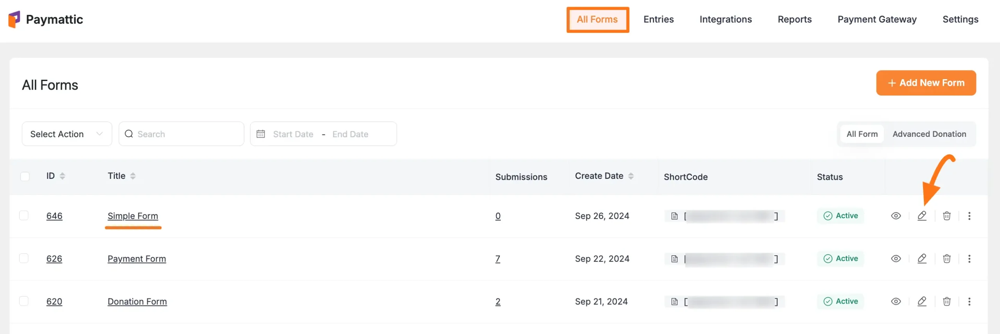
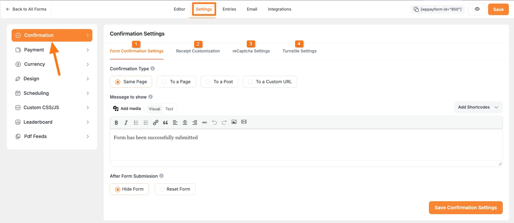
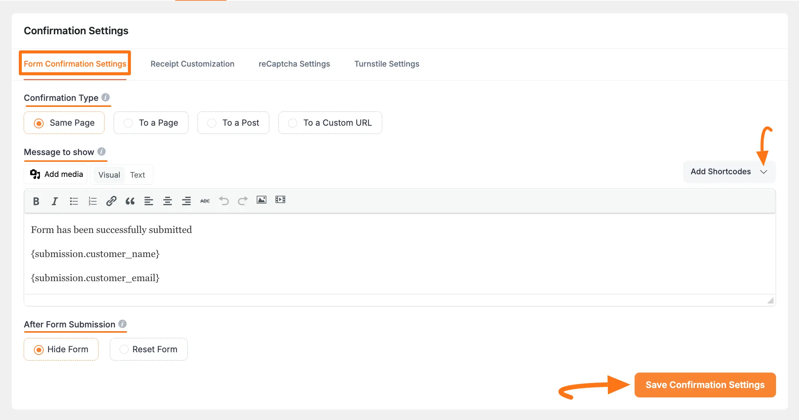
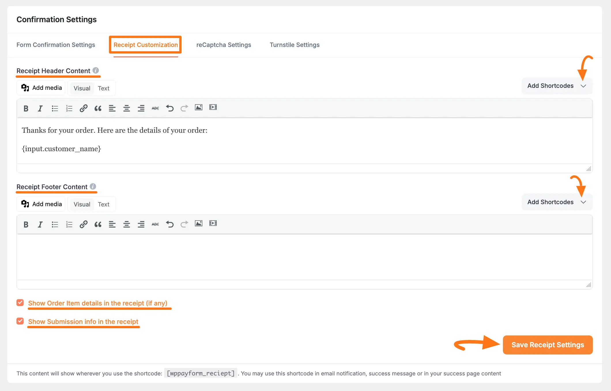
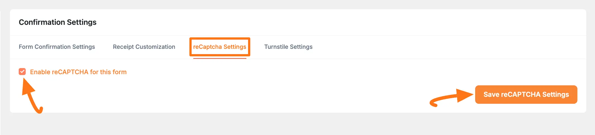
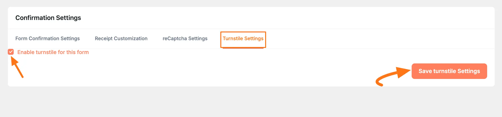

[Paymattic](https://paymattic.com/) offers the **Confirmation** settings option which allows you to define and display a confirmation message once each form on your website is submitted. This article will guide you through the process of Configuring Confirmation of Forms in Paymattic.

## Configuring Confirmation Settings

To learn how to configure **Confirmation Settings** of a specific form, follow the steps with the screenshots below –

First, go to the **All Forms** section from the **Pymattic Navbar,** choose a **Form,** and click the **Pencil/Edit** icon to open the **Editor** page of that form.

If you do not have any existing forms, read this [Create a Form from Scratch](../form-editor/how-to-create-a-form-from-scratch-with-paymattic.md) or [Create a Form using Templates](../form-editor/simple-form-templates.md) documentation to create one.

For example, I choose an existing form to show the whole process.

Once you open the **Editor** page, go to the **Settings** tab from the left sidebar, and you will get the **Confirmation** settings option.

Here you will get the four types of Confirmation Settings tab. These are:

1. Form Confirmation Settings
2. Receipt Customization
3. reCaptcha Settings
4. Turnstile Settings

- *All the confirmation settings mentioned above are explained below –**

### 1. Form Confirmation Settings

This feature allows you to customize the confirmation settings for form submissions.
- **Confirmation Type**: This setting allows you to choose where the confirmation message will appear after a payment form is submitted. You can choose to display it on the **same page**, on a different page (**To a Page**), **or** on a specific post (**To a Post)**. Alternatively, you can generate a custom URL (**To a Custom URL**) to display the confirmation message or report based on your settings.
- **Message to Show**: Type custom text in this box to define the content you want to show in your confirmation message. You can also **Add** **Shortcode/s** to fetch other necessary information.
- **After Form Submission**: After submitting a payment form, you can decide whether you want to **Hide** or **Reset** the form.

Once you are done, click the **Save Confirmation Settings** button to save all changes.

### 2. Receipt Customization

The Receipt Customization tab lets you customize the content of the receipt that will be shown along with the confirmation message.
- **Receipt Header Content**: Type custom text in this box to define the content that you would like to show your users on the header of the receipt. You can also **Add** **Shortcode/s** to fetch other necessary information.
- **Receipt Header Content**: As in the Header Content box, you can define the content of the footer in the Footer Content box. You can also **Add** **Shortcode/s** to fetch other necessary information.
- **Show Order Item details in the receipt (if any)**: Enable this button to display all the products or services that are ordered by the user.
- **Show Submission info in the receipt**: Check the button to display all the data that was filled in by the user in the form.

After customizing everything, click the **Save Receipt Settings** button to save all changes.

### 3. reCaptcha Settings

You can enable reCaptcha for any form with the **reCaptcha** **Settings** tab.

Check this [Documentation](../global-settings/how-to-configure-recaptcha-in-wordpress-with-paymattic.md) to learn more about how to configure reCAPTCHA.

### 4. Turnstile Settings

You can enable Turnstile for any form with the **Turnstile** **Settings** tab.

Check this [Documentation](../global-settings/how-to-configure-cloudflare-turnstile-with-paymattic.md) to learn more about how to configure the Turnstile.

This is the simple process to configure the form Confirmation Settings in Paymattic. 
If you have any further questions, concerns, or suggestions, please do not hesitate to contact our [support team](https://wpmanageninja.com/support-tickets/). Thank you.