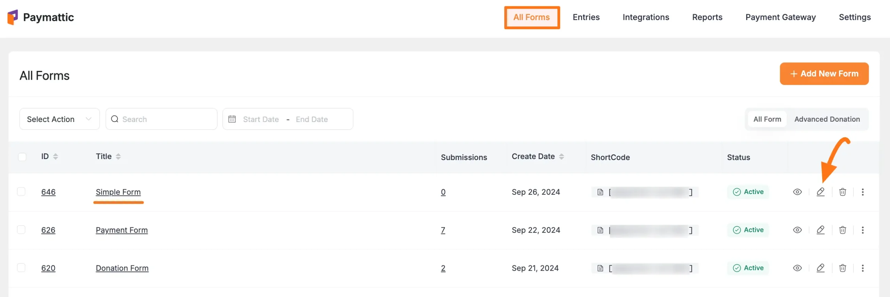
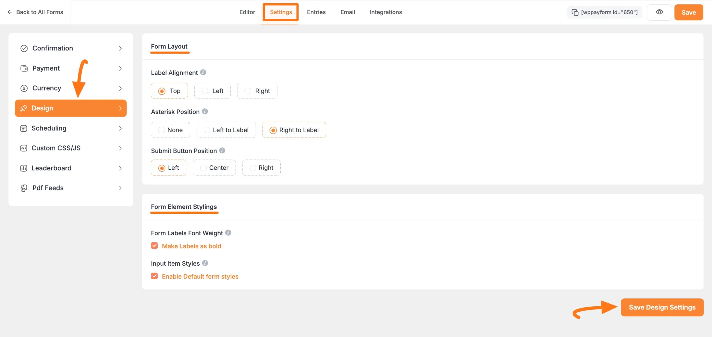
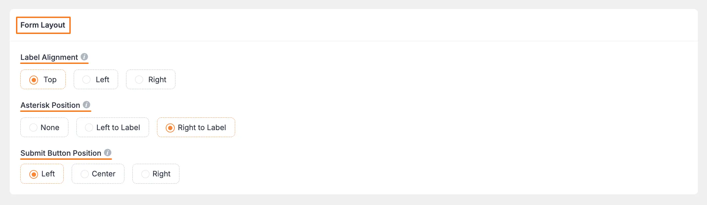
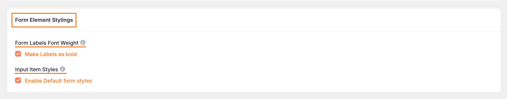

# How to Customize Form Design Settings in WordPress with Paymattic?

[Paymattic](https://paymattic.com/) offers the **Design** settings option which allows you to style your form's design as you want. This article will guide you through the process of Designing Forms according to your own preferences in Paymattic.

## Customizing Form Design

To learn how to Customizing the Design of a specific form, follow the steps with the screenshots below –

First, go to the **All Forms** section from the **Paymattic Navbar**, choose a **Form**, and click the **Pencil/Edit** icon to open the **Editor** page of that form.

::: tip
If you do not have any existing forms, read [Create a Form from Scratch](../form-editor/how-to-create-a-form-from-scratch-with-paymattic.md) or [Create a Form using Templates](../form-editor/simple-form-templates.md) documentation to create one.
:::

For example, I choose an existing form to show the whole process.

Once you open the **Editor** page, go to the **Settings** tab from the left sidebar, and you will get the **Design** settings option to customize your form's design.

Here, you will get two different sections for customizing the design. These are:

- Form Layout
- Form Element Styling

After completing the setup, click the **Save Design Settings** button to save all your changes.

**The two sections mentioned above are explained below:**

### Form Layout

There are three configuration options available in the Form Layout section:

- **Label Alignment**: This option lets you select the default label placement. Labels can be placed on top of a field, to the left of a field, or to the right of a field.
- **Asterisk Position**: This option lets you select the asterisk marker position for the required element. You can set the asterisk position to None, Left to Label, and Right to Label.
- **Submit Button Position**: This option allows you to choose where you want to show your submit button. You can place the submit button on the form's left, center, or right side.

### Form Element Styling

This section helps you to design the form label and the input items. You can enable the default form styles in this part.

- **Form Labels Font Weight**: Here, you can select how you want to show the form labels. To make the form labels bold check the option Make Labels as bold.
- **Input Item Styles**: Check this if you want default input stylings offered by Paymattic.

These are all the customization options available currently with the Design feature!
If you have any further questions, concerns, or suggestions, please do not hesitate to contact our [@support team](https://wpmanageninja.com/support-tickets/). Thank you.