[Paymattic](https://paymattic.com/) provides 20 general fields to design a standard payment form for your WordPress Site. This article will give you an overview of Paymattic's General Fields.

<iframe width="560" height="315" src="https://www.youtube.com/embed/u8EXokI4g8c?list=PLXpD0vT4thWH80g5e9wYnoBMgEqUXbr53" title="How to Use the General Fields" frameborder="0" allow="accelerometer; autoplay; clipboard-write; encrypted-media; gyroscope; picture-in-picture" allowfullscreen></iframe>

Only to get access to the **File Upload** and **Mask Input** fields, you must have the Paymattic Pro plugin.

## Getting General Fields Section

To learn how you can find the General Fields section, follow the steps with the screenshots below –

First, go to the **All Forms** section from the **Pymattic Navbar,** choose a **Form,** and click the **Pencil/Edit** icon to open the **Editor** page of that form.

If you do not have any existing form, read this [Create a Form from Scratch](../form-editor/how-to-create-a-form-from-scratch-with-paymattic.md) or [Create a Form using Templates](../form-editor/simple-form-templates.md) documentation to create one. **For example,** I choose an existing form to show the whole process.

Once you open the **Editor** page, type the **" / "** or click the **" + "** icon placed at the bottom to get the General Fields section.

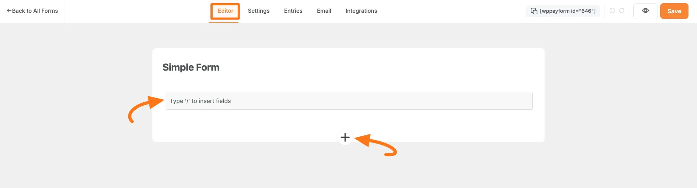

On the **Choose form field** page, you will find all the desired **general input fields** under the **General Fields** section.

Now, you can select any field/s according to your needs by simply clicking on its name.

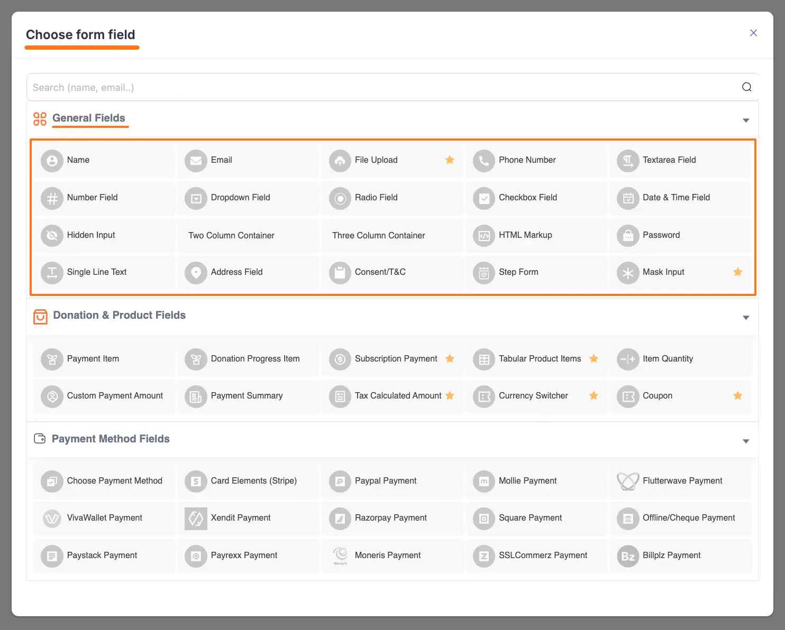

## Common Settings of General Fields

All the general input fields have some common settings options for configuration. For a better understanding of each field, the common setting options are explained below –

After adding your desired field/s, click the **Settings** icon in the right corner of a field that you wish to work on.

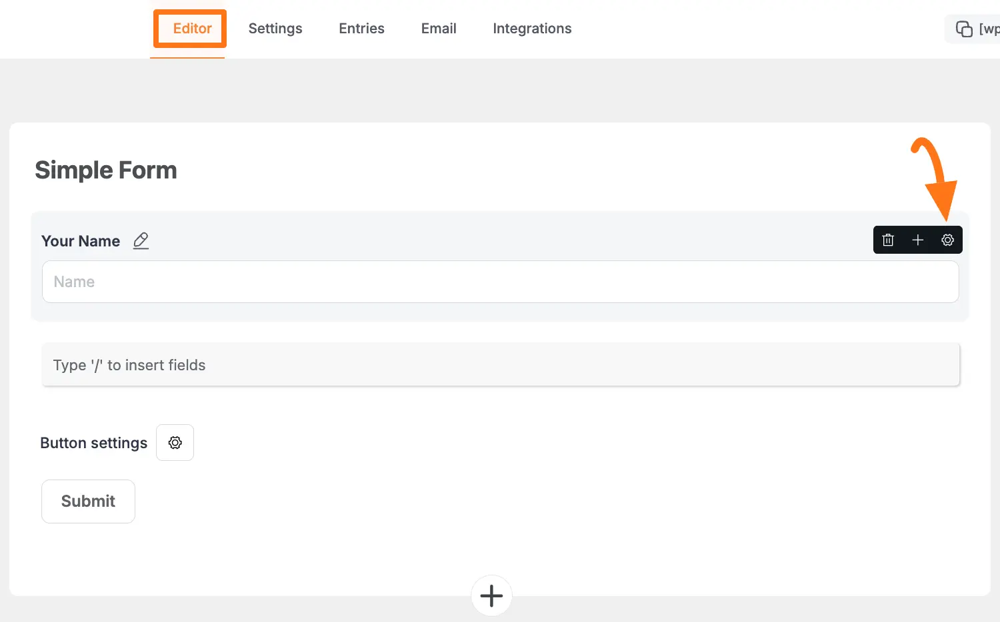

Once you click the **Settings** **Icon**, two settings options will appear. These are:

1. General Settings
2. Advanced Settings

### A. General Settings Options

Once you click the Settings icon, the **General** settings options will appear. These are:
- **Required**: Enable this option to make this field mandatory for users to fill in for a successful submission.
- **Default Value**: You can set a value for this field using the **Shortcode** button or by entering a **Custom** **Value** to display default data in your form.

Once you set up all the settings, click the **Update** button to save all the customizations.

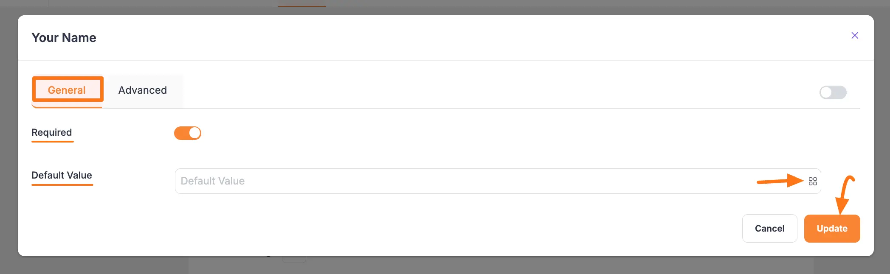

### B. Advanced Settings Options

Once you complete the General settings, go to the **Advanced** tab, and you will find some advanced settings for your field. These are:
- **Admin Label**: This label is used for the admin wants to see the field's label from the back end.
- **Field Wrapper CSS Class**: This is used for adding a Custom CSS/JS for an entire field of a specific form using the Field Wrapper CSS Class element. To learn more, click [here](../form-settings/how-to-create-custom-css-js-in-wordpress-with-paymattic.md).
- **Input Elements CSS Class**: This is used for adding a Custom CSS/JS for a specific input field of a form using the Input Elements CSS Class element. To learn more, click [here](../form-settings/how-to-create-custom-css-js-in-wordpress-with-paymattic.md).
- **Conditional Render**: You can set conditional logic to display the field in the form that will be triggered by specific actions taken on a previous input field. To learn more about conditional renderings, click [here](../form-editor/how-to-use-conditional-logic-in-form-fields-with-paymattic.md).
- **Field ID**: This option is used for adding or tracking form fields. Plus, creating the custom CSS/JS for a specific form field.

Once you finish, click the **Update** button to save all your configuration.

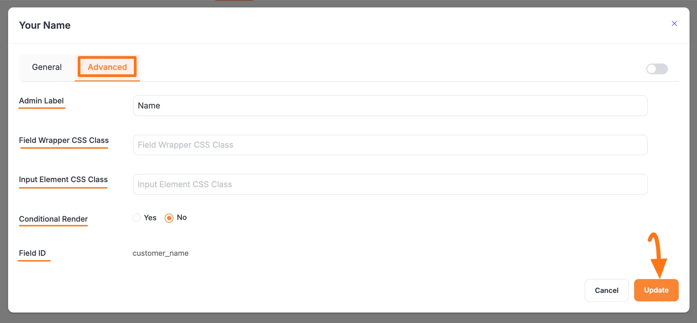

## Detail of All General Fields

All the General Fields mentioned above are explained below:

### 1. Name

This field in the payment form is used to collect the customers' names when they fill up the payment form. The General &amp; Advanced **Settings** option of the **Name** field is already above.

To learn the detailed use of **General Settings**, click [here](#a-general-settings-options), and for **Advanced Settings**, click [here](#b-advanced-settings-options).

### 2. Email

This field is used to take customer email addresses as input. The settings options are:
- **Unique Email**: It will show an error message to the user if they input any value other than a valid email address.
- **Enable Confirm Email Field**: You can enable the Confirm Email Field to make sure your users put the right email address.

To learn the detailed use of **General Settings**, click [here](#a-general-settings-options), and for **Advanced Settings**, click [here](#b-advanced-settings-options).

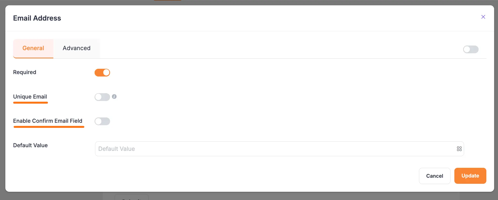

### 3. File Upload

It is a premium feature of the Paymattic plugin. If you want your users to upload single or several files when completing the form, you can utilize the File Upload input field. The General Settings options are:
- **Upload Button Text**: This is the text that will appear on the button.
- **Required**: Enable this option to make this field mandatory to for users to fill in for a successful submission.
- **Max File Size**: It specifies the maximum file size that can be uploaded. This is a vital option if you do not want to use much of your hosting storage.
- **Max Upload Files**: This option allows you to set the limit on the number of files that can be uploaded.
- **Allowed File Types**: It's a crucial choice for keeping a potential attacker away. Here, you can specify the types of files that the user can upload.

To see the detailed use of the **Advanced Settings** option, click [here](#b-advanced-settings-options).

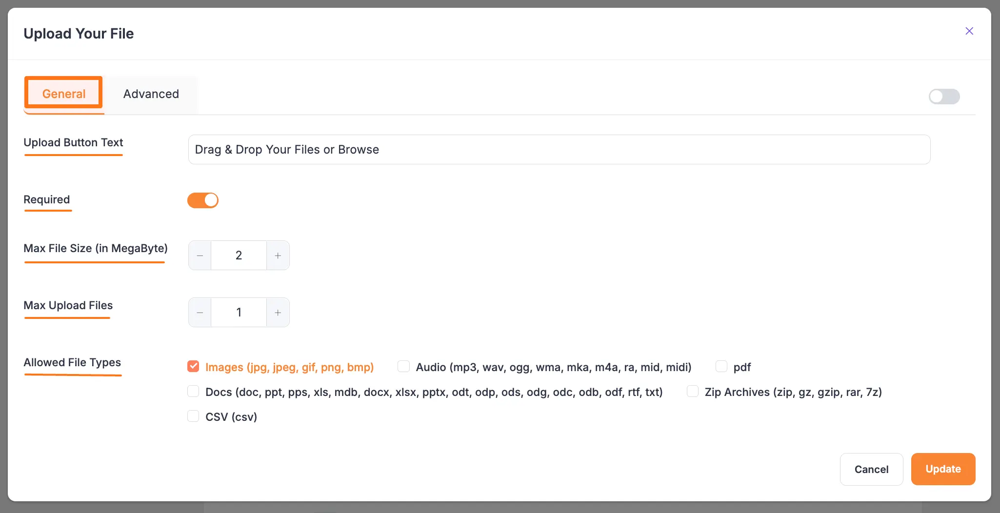

### 4. Phone Number 

You can use the Phone Number field to take the user's phone number as input. The General Settings options are:
- Required: This option lets you enable and disable the field's required status. The required option indicates that the input field must be filled up before the form can be submitted.
- Default Country: From the dropdown, you can choose any country as default according to your needs.
- Show Status: In show status, there are 4 available statuses such as All, Hide These, Show All These &amp; Priority-based where you can show your Country List by choosing any status option.

To see the detailed use of the **Advanced Settings** option, click [here](#b-advanced-settings-options).

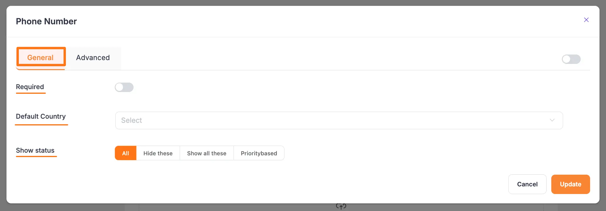

### 5. Text Area Field

The Textarea field allows you to accept text input in the form of a paragraph. The settings options are:
- Minimum Height: You can adjust the text area field's height to suit your demands; in this case, the number field will be measured in pixels (px).

To learn the detailed use of **General Settings**, click [here](#a-general-settings-options), and for **Advanced Settings**, click [here](#b-advanced-settings-options).

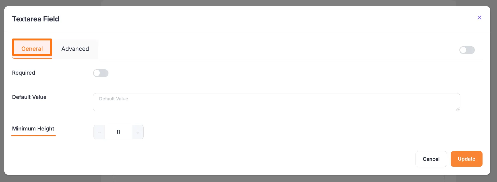

### 6. Number Field

The Number Field is another frequently used input field in the payment form, which is utilized to take any numeric value while completing the payment form. Also, if you wish to have your clients' phone numbers, you can apply this input field. You can set a minimum value for this input field.

The General settings options of Number Field are:
- **Required**: Enable this option to make this field mandatory for users to fill in for a successful submission.
- **Default Value**: You can set a value for this field using the Shortcode button or by entering a Custom Value to display default data in your form.
- **Minimum Value**: This setting lets you set the smallest allowed value for the field. If a user enters a value lower than this, the form will show an error, ensuring the input meets your criteria.
- *Maximum Value**: This setting lets you set the largest allowed value for the field. If a user enters a value higher than this, the form will show an error, ensuring the input stays within the limit.

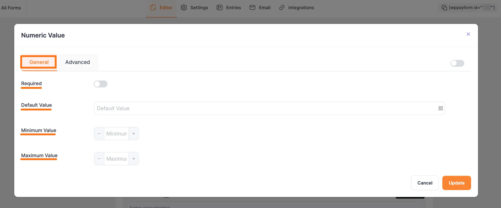

The Advanced settings options of Number Field are:
- **Enable Calculation**: Enabling this feature wil allow you to perform real-time mathematical operations for the **Number** and **Product** fields within any [Payment Form](../form-editor/how-to-create-your-first-payment-form-in-a-minute-and-accept-payments-with-paymattic.md). Now, add the desired equation under the **Calculation Expression** box to ensure what calculation you want to perform. To know the detailed guidelines of this **Calculation Feature**, read this [Documentation](../general-input-fields/how-to-use-the-product-fields.md#calculation-feature).
- **Enable Additional Checks**: Enable this option to set an extra layer of data integrity check.

To learn the detailed use of **Advanced Settings**, click [here](#b-advanced-settings-options).

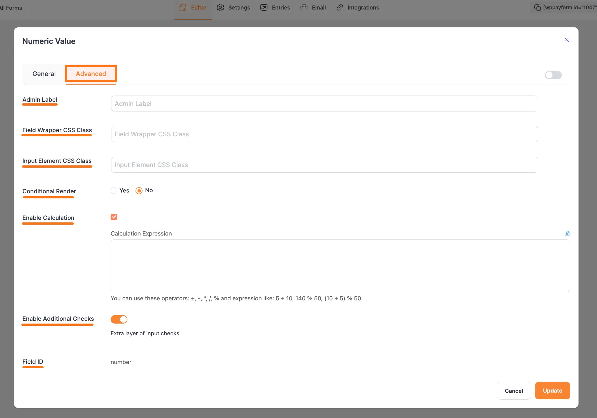

### 7. Dropdown Field

This field lets you add multiple values to the form as a dropdown list. For example, if you want to provide multiple alternatives to clients, you can utilize this input field.

To learn the detailed use of **General Settings**, click [here](#a-general-settings-options), and for **Advanced Settings**, click [here](#b-advanced-settings-options).

### 8. Radio Field

The Radio Field allows you to add multiple values as a radio button in the form.

This field lets users choose an option from a given set of multiple options. Users can not select more than one option at a time in the radio field.

Plus, the **Inline Radio Items** option lets you showcase your radio options horizontally in one line.

To learn the detailed use of **General Settings**, click [here](#a-general-settings-options), and for **Advanced Settings**, click [here](#b-advanced-settings-options).

### 9. Checkbox Field

The Checkbox field is an input field that is used in the payment form to add a list of values using the checkbox button.

Unlike the radio field, this field allows users to select more than one option at once. So, you can use this field where you need to take multiple selection data in the form.

Plus, the **Inline Checkbox Items** option lets you showcase your checkbox options horizontally in one line.

To learn the detailed use of **General Settings**, click [here](#a-general-settings-options), and for **Advanced Settings**, click [here](#b-advanced-settings-options).

### 10. Date &amp; Time Field

Use the Date Field to take a date as input such as date of birth, or joining date.

This field opens up in calendar format when the user clicks on the date field. You can specify various date formats to take as input from users.

To learn the detailed use of **General Settings**, click [here](#a-general-settings-options), and for **Advanced Settings**, click [here](#b-advanced-settings-options).
Additionally, to learn the Date Format Customization, click [here](../faq/date-formats-customization.md).

### 11. Hidden Input

This is an invisible input field that is not shown in the form while submitting the data. You can use this field to collect system data such as the date and time of form submission, the username, the display name, the site title, the site URL, etc.

And, you can collect all these data according to your needs by using the **Input Value** option under the **General Settings** tab. This setting defines the dynamic value that you want to collect while the user submits the form.

To learn the detailed use of **General Settings**, click [here](#a-general-settings-options), and for **Advanced Settings**, click [here](#b-advanced-settings-options).

### 12. Two Column Container

This field is used to add two fields horizontally in one column instead of a new column for each field for your **Paymattic Forms** and make them look more compact and organized to your users.

The Three Column Container field has the same functionality except for the number of added columns. To learn more, read this [Documentation](../general-input-fields/how-to-add-multiple-column-containers-with-paymattic.md).

### 13. Three Column Container

This field is used to add three fields horizontally in one column instead of a new column for each field for your **Paymattic Forms** and make them look more compact and organized to your users.

The Two Column Container field has the same functionality except for the number of added columns. To learn more, read this [Documentation](../general-input-fields/how-to-add-multiple-column-containers-with-paymattic.md).

### 14. HTML Markup

HTML markup is a strong tool for your payment form. Using this field, you can add elements containing HTML code.

For example, if you want to display an image in your form, you can use HTML Markup to do so. Besides, you can add certain dynamic values to your form using shortcodes such as **{payment\_total}**, **{sub\_total}**,**{tax\_total}**.

To learn the detailed use of **General Settings**, click [here](#a-general-settings-options), and for **Advanced Settings**, click [here](#b-advanced-settings-options).

### 15. Password

The Password field lets you add a password field in the form. It takes data in a password format while filling up the form.

To learn the detailed use of **General Settings**, click [here](#a-general-settings-options), and for **Advanced Settings**, click [here](#b-advanced-settings-options).

### 16. Single Line Text

Use the Single Line Text field if you want your users to write a few words to specify any issue in the form.

To learn the detailed use of **General Settings**, click [here](#a-general-settings-options), and for **Advanced Settings**, click [here](#b-advanced-settings-options).

### 17. Address Field

It is a very vital field to take a user's address or location data as input. You can collect Street addresses, City, State, Zip Code, and Country in different sub-sections.

To learn the detailed use of **General Settings**, click [here](#a-general-settings-options), and for **Advanced Settings**, click [here](#b-advanced-settings-options).

### 18. Content/ T&amp; C

​​This option allows you to include Terms and Conditions in your form. You can enter your Terms Text and Terms Description here. You can also select whether the field should be required or optional.

To learn the detailed use of **General Settings**, click [here](#a-general-settings-options), and for **Advanced Settings**, click [here](#b-advanced-settings-options).

### 19. Step Form

This field is used to create multi-step forms easily that allow you to collect more data without scaring the users away.

To learn more about this field, read this [Documentation](../form-editor/creating-a-step-form-with-paymattic.md).

### 20. Mask Input

Mask Input allows website administrators to specify a format for users to use when filling out a form.

For example, a phone number input field may allow 11 digits or 10 digits for a specific country to pass through, but it may not allow passing inputs in any other format.

To learn the detailed use of **General Settings**, click [here](#a-general-settings-options), and for **Advanced Settings**, click [here](#b-advanced-settings-options).

These are all the General fields that you can use while creating a form in Paymattic.
All of the fields here help you design a payment form easier and faster.
If you have any further questions, concerns, or suggestions, please do not hesitate to contact our [support team](https://wpmanageninja.com/support-tickets/). Thank you.