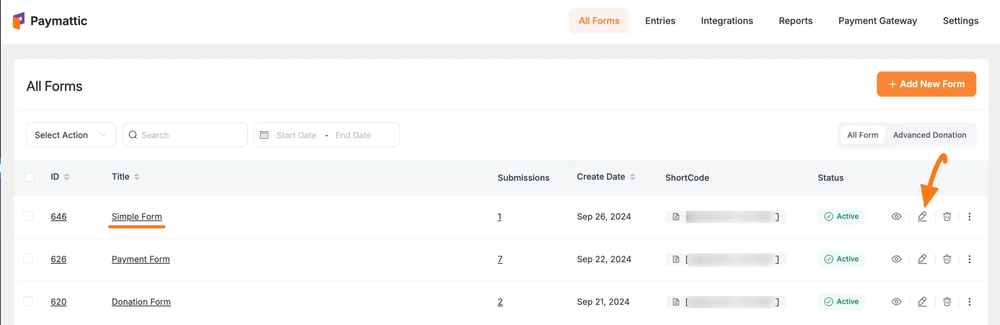
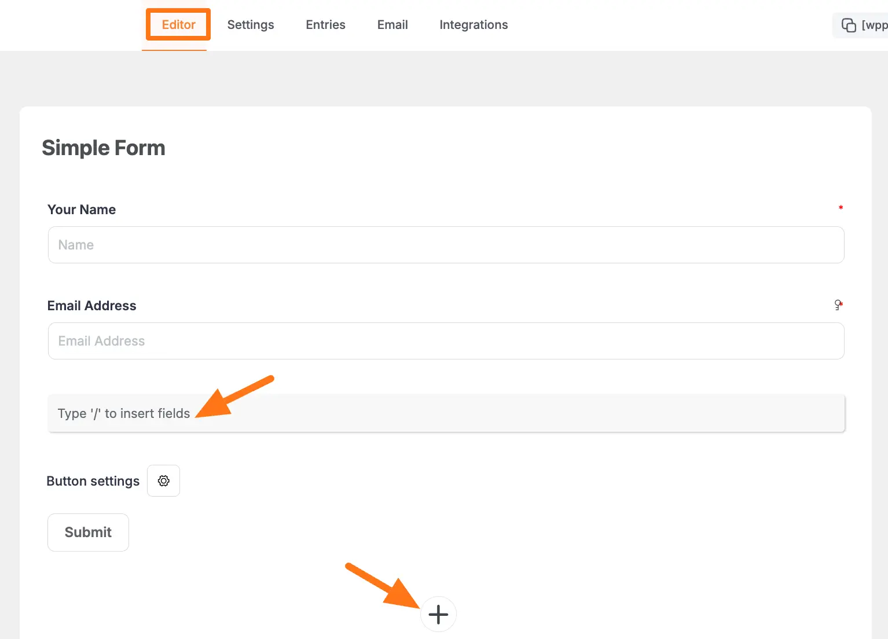
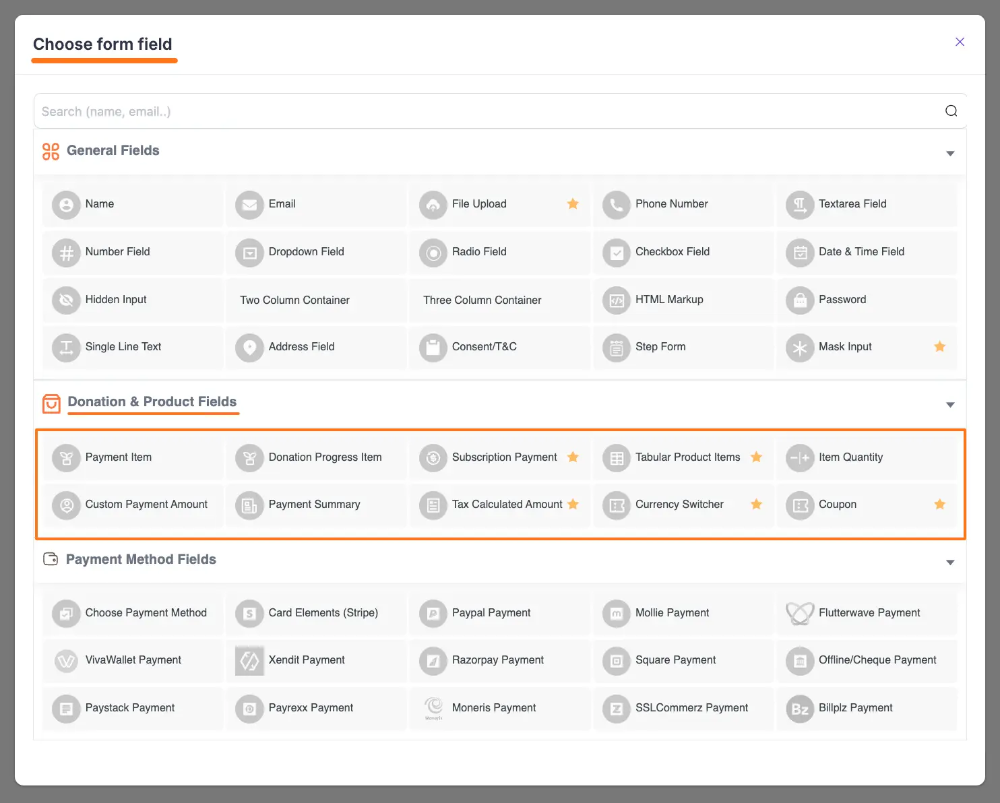

[Paymattic](https://paymattic.com/) provides 10 product fields to design a standard payment form for your WordPress Site. This article will give you an overview of Paymattic's General Fields.

But to get access to the premium fields, you must have the Paymattic Pro plugin.

## Getting Product Fields Section

To learn how you can find the Product Fields section, follow the steps with the screenshots below –

First, go to the **All Forms** section from the **Pymattic Navbar,** choose a **Form,** and click the **Pencil/Edit** icon to open the **Editor** page of that form.

If you do not have any existing form, read this [Create a Form from Scratch](../form-editor/how-to-create-a-form-from-scratch-with-paymattic.md) or [Create a Form using Templates](../form-editor/simple-form-templates.md) documentation to create one.

For example, I choose an existing form to show the whole process.

Once you open the **Editor** page, type the **" / "** or click the **" + "** icon placed at the bottom to get the Product Fields section.

On the **Choose form field** page, you will find all the desired **Product fields** under the **Donation &amp; Product Fields** section.

Now, you can select any field/s according to your needs by simply clicking on its name.

Remember, **Fields with a Star Sign** in the right corner **are Pro features**. You need to install and activate the Paymattic Pro plugin to use them.

## Detail of All Donation &amp; Product Fields

To learn more about all the Product Fields in detail, refer to the articles below –

##### 1. [Payment Item](../donation-and-product-fields/how-to-add-payment-item-fields-in-wordpress-with-paymattic.md) 

##### 2. [Donation Progress Item](../donation-and-product-fields/how-to-add-donation-progress-item-in-wordpress-with-paymattic.md)

##### 3. [Subscription Payment](../donation-and-product-fields/how-to-add-susbcription-payment-item-fields-in-paymattic.md)

##### 4. [Tabular Product Items](../donation-and-product-fields/how-to-add-tabular-product-item-fields-in-wordpress-with-paymattic.md)

##### 5. [Item Quantity](../donation-and-product-fields/how-to-add-item-quantity-field-in-wordpress-with-paymattic.md)

##### 6. [Custom Payment Amount](../donation-and-product-fields/how-to-add-user-defined-amount-field-in-wordpress-with-paymattic.md) 

##### 7. [Payment Summary](../donation-and-product-fields/add-payment-summary-field-in-forms.md) 

##### 8. [Tax Calculated Amount](../donation-and-product-fields/how-to-add-tax-calculated-amount-field-in-wordpress-with-paymattic.md)

##### 9. [Currency Switcher](../donation-and-product-fields/add-currency-switcher-in-wordpress-form.md)

##### 10. [Coupon](../donation-and-product-fields/how-to-add-coupon-field-in-wordpress-with-paymattic.md)

These are all the Product Fields you can use while creating forms in Paymattic. 
If you have any further questions, concerns, or suggestions, please do not hesitate to contact our [support team](https://wpmanageninja.com/support-tickets/). Thank you.